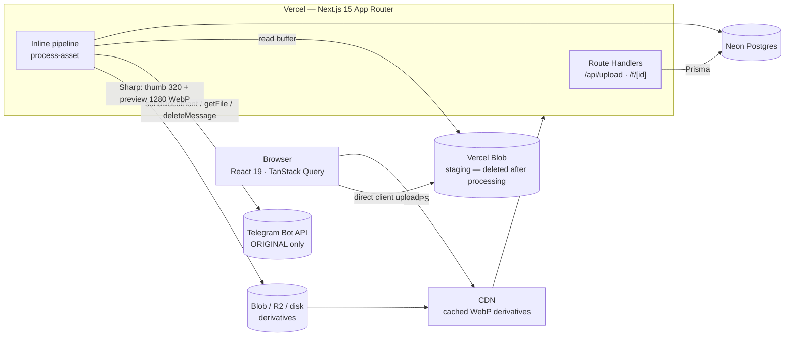

<div align="center">

# ☁️ HuaCloud

### A modern, AI-ready digital asset manager that turns a **Telegram channel into invisible, unlimited cold storage**.

Upload photos like Google Photos — but every original quietly lives on Telegram for free, while a Cloudflare-backed CDN serves lightning-fast WebP thumbnails. No S3 bill. No storage limit. Fully self-hostable.

<br/>

[](https://nextjs.org/)
[](https://react.dev/)
[](https://www.typescriptlang.org/)
[](https://www.prisma.io/)
[](https://neon.tech/)
[](https://tailwindcss.com/)


<br/>

**[Live Demo](https://hua-cloud-huahung.vercel.app)** · **[Report Bug](https://github.com/HuaThinhHung/HuaCloud/issues)** · **[Request Feature](https://github.com/HuaThinhHung/HuaCloud/issues)**

<sub>If this project sparks an idea, a ⭐ means the world to a solo developer.</sub>

</div>

---

## 📸 Screenshots

> _Drop your screenshots here — a hero shot of the gallery does more for stars than a thousand words._

<div align="center">

| Gallery | Lightbox | Upload |
|:---:|:---:|:---:|
| _add `docs/screenshots/gallery.png`_ | _add `docs/screenshots/lightbox.png`_ | _add `docs/screenshots/upload.png`_ |

</div>

---

## 💡 Why HuaCloud?

Most image hosts force a trade-off: pay for object storage (S3, Cloudinary) **or** accept a clunky "upload to Telegram" hack with a bot-token URL leaking everywhere.

**HuaCloud refuses the trade-off.** It treats Telegram as a pure, invisible **cold-storage backend** behind a clean storage-driver interface, and puts a real product on top of it:

- 🫥 **Telegram is completely hidden.** Users never see a bot, a chat, or a token. The gallery *never touches Telegram* — it serves derivatives from a CDN. Telegram is only hit when you download the untouched original.
- 🖼️ **Originals are preserved byte-for-byte.** Every file is uploaded with `sendDocument` (never `sendPhoto`, which re-compresses and strips EXIF). A DAM must never lose a byte.
- ⚡ **Hot path is CDN-only.** Thumbnails (320px) and previews (1280px) are generated with Sharp, stored on Vercel Blob / Cloudflare, and served with `immutable` cache headers. Scrolling thousands of photos never round-trips to Telegram.
- 🔌 **Storage is swappable by design.** `Telegram → R2 → local disk` are all drivers behind one interface. Leaving any vendor is "add an adapter," not "rewrite the app."
- 🧱 **Built to become a SaaS.** The schema ships day-one with workspaces, API keys, usage metering, and multi-channel routing — the expensive-to-retrofit stuff — even where V1 has no UI for it yet.

> ⚠️ **Honesty note:** this started as a fork of the CC0-licensed [Telegraph-Image](https://github.com/cf-pages/Telegraph-Image), which is used **only** as a reference for the Telegram integration. Everything you see here — the architecture, the data model, the UI, the storage pipeline — is a ground-up rebuild.

---

## ✨ Features

### ✅ Available now

| | Feature |
|---|---|
| 📤 | **Smart upload pipeline** — client → Vercel Blob staging → Sharp derivatives → Telegram original → auto-cleanup, with an **atomic claim** that prevents duplicate pushes on serverless retries |
| 🖼️ | **Fast gallery** — grid view, blur-hash placeholders (instant paint), favorites, and search by filename |
| 🔍 | **Lightbox viewer** — full-screen preview with keyboard navigation |
| ❤️ | **Favorites & Trash** — soft-delete with a 30-day recovery window |
| 🎨 | **Auto image processing** — WebP thumbnail (320px) + preview (1280px), EXIF `takenAt` extraction, dominant-color detection, EXIF auto-rotation |
| 🗄️ | **3 pluggable storage backends** — Telegram (originals), Vercel Blob (cloud derivatives), local disk (dev) — chosen automatically per environment |
| 🔐 | **Single-account auth** — HMAC-signed, edge-compatible session cookie; production refuses to boot without a password set |
| 🩺 | **Health & ops** — `/api/health` endpoint plus `telegram:setup`, `telegram:health`, `test:upload`, and `backup` scripts |

### 🛡️ Security, baked in

- **Magic-byte verification** via Sharp — the browser's `Content-Type` is never trusted
- **Decompression-bomb guard** — images over ~100 megapixels are rejected
- **Constant-time** cookie comparison to defeat timing attacks
- **Fail-fast env validation** with Zod at boot — a misconfigured production instance won't silently expose itself
- **Bot token never leaves the server** — all Telegram fetches happen server-side inside route handlers

### 🚧 On the roadmap (schema-ready)

The database schema was designed up front for these — they need UI/services, not migrations:

- 🤖 **AI enrichment** (Gemini 2.5 Flash): auto captions, tags, OCR, object & color detection
- 🧠 **Semantic search** with pgvector — natural-language queries like _"find the blue shirt"_
- 📁 **Albums & smart albums** · 🔗 **Shareable links** (password, expiry, download limits, QR) · 👥 **Multi-workspace** · 🔑 **Public REST API + API keys** · 📊 **Usage metering**

---

## 🏗️ Architecture

A single Next.js 15 monolith on Vercel, with managed services around it. The gallery hot path is pure CDN; heavy work runs after the response.



**Upload:** client uploads straight to Vercel Blob (bypassing Vercel's 4.5 MB body limit) → the pipeline derives thumbnails, pushes the original to Telegram, then deletes the staging file. **View:** thumbnails come from the CDN, never Telegram. **Download original:** `/f/[id]` resolves the Telegram `file_path` (cached ~50 min) and streams it back — the token stays server-side.

<details>
<summary><b>📂 Project structure</b></summary>

```text
src/
├─ app/
│  ├─ (app)/          # authed shell: dashboard, gallery, favorites, trash, settings
│  ├─ api/            # upload, assets, health, login/logout
│  └─ f/[id]/         # serve original — Telegram proxy (token stays server-side)
├─ features/          # self-contained UI: upload/, gallery/
├─ components/layout/ # sidebar, topbar
├─ server/            # server-only code
│  ├─ services/       # business logic — the ONLY place that touches Prisma
│  ├─ storage/        # StorageDriver interface + telegram/ · blob · local
│  ├─ media/          # Sharp pipeline
│  └─ jobs/           # process-asset queue
├─ lib/               # env (Zod), auth (HMAC), utils
└─ types/
prisma/               # schema + migrations
docs/                 # full vision, PRD, architecture & roadmap
```

</details>

---

## 🛠️ Tech Stack

| Layer | Choice | Why |
|---|---|---|
| **Framework** | Next.js 15 (App Router, RSC) · React 19 | One codebase for UI + API; server components keep the gallery bundle small |
| **Language** | TypeScript (strict) | Types derived from Zod — one source of truth |
| **Database** | PostgreSQL on [Neon](https://neon.tech) + Prisma 6 | Relational + branchable; pgvector-ready for future AI search |
| **Styling** | Tailwind CSS v4 · Geist · Lucide | Minimal, dark-first, Apple/Linear-inspired |
| **Data layer** | TanStack Query v5 | Infinite scroll, optimistic updates, status polling |
| **Images** | Sharp | Thumbnail/preview generation, EXIF, blur placeholders |
| **Storage** | Telegram Bot API · Vercel Blob · local disk | Free unlimited originals + CDN-served derivatives |
| **Validation** | Zod | Shared client ↔ server ↔ env schemas |
| **Deploy** | Vercel | Push to `main` = auto-deploy |

---

## 🚀 Quick Start

### Prerequisites
- Node.js 20+
- A PostgreSQL database ([Neon](https://neon.tech) free tier works great)
- A Telegram Bot token + a channel the bot administrates *(optional for local dev — falls back to disk)*

### 1. Clone & install

```bash
git clone https://github.com/HuaThinhHung/HuaCloud.git
cd HuaCloud
npm install
```

### 2. Configure environment

Create a `.env` file:

```bash
# Database (Neon)
DATABASE_URL="postgresql://...-pooler.../db"   # pooled connection
DIRECT_URL="postgresql://.../db"               # direct — used by prisma migrate

# Telegram storage (optional locally; required in production)
TELEGRAM_BOT_TOKEN="123456:AA..."
TELEGRAM_CHAT_ID="-1001234567890"

# Access protection (required in production, optional locally)
APP_PASSWORD="a-strong-password"
SESSION_SECRET="a-32-byte-random-string"

# Cloud derivatives when deployed (Vercel Blob)
BLOB_READ_WRITE_TOKEN="vercel_blob_rw_..."

# AI enrichment (optional — roadmap)
GEMINI_API_KEY=""
```

### 3. Set up the database & Telegram

```bash
npm run db:push          # apply the Prisma schema
npm run telegram:setup   # verify the bot & channel wiring
```

### 4. Run

```bash
npm run dev              # http://localhost:3000
```

That's it — drag a photo onto the gallery and watch it flow through the pipeline. Locally, with no Telegram configured, originals are stored on disk so you can develop offline.

<details>
<summary><b>📜 All scripts</b></summary>

```bash
npm run dev              # dev server
npm run build            # production build
npm run start            # production server
npm run lint             # eslint
npm run typecheck        # tsc --noEmit
npm run db:push          # push schema to DB
npm run db:migrate       # create a migration
npm run db:seed          # seed data
npm run telegram:setup   # verify bot/channel
npm run telegram:health  # channel health check
npm run test:upload      # end-to-end upload test
npm run backup           # export a backup
```

</details>

---

## ☁️ Deploy to Vercel

1. Import the repo on [Vercel](https://vercel.com/new).
2. Add the environment variables above (production **requires** `APP_PASSWORD`, `SESSION_SECRET`, `TELEGRAM_BOT_TOKEN`, `TELEGRAM_CHAT_ID`, and `BLOB_READ_WRITE_TOKEN`).
3. Deploy. Every push to `main` ships automatically.

> Guard rail: the app **refuses to boot on Vercel** without a password + session secret — so you can never accidentally ship an open instance.

---

## 🗺️ Roadmap

- [x] Upload pipeline with atomic dedup claim
- [x] Gallery, favorites, trash, lightbox
- [x] Telegram / Blob / local storage drivers
- [x] Single-account auth + production guard rails
- [ ] AI enrichment (captions, tags, OCR) via Gemini
- [ ] Semantic search with pgvector
- [ ] Albums & smart albums
- [ ] Shareable links (password, expiry, QR)
- [ ] Multi-workspace + public REST API
- [ ] Durable background jobs (Inngest) + Cloudflare R2

See [`docs/`](docs/) for the full vision, product requirements, and architecture decisions.

---

## 🤝 Contributing

Issues and PRs are welcome. If you're using HuaCloud, a ⭐ helps others find it.

## 📄 License

Released under the [MIT License](LICENSE). The Telegram-integration reference, [Telegraph-Image](https://github.com/cf-pages/Telegraph-Image), is CC0 1.0 (public domain) — no attribution required, but credited here in good faith.

---

<div align="center">

Built with care by **[Hua Thinh Hung](https://github.com/HuaThinhHung)** — IT Executive · Full-Stack & Shopify Developer

<sub>⭐ Star this repo if the invisible-Telegram-storage idea made you smile.</sub>

</div>
