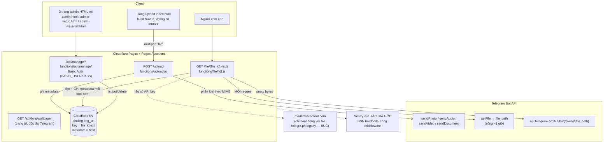

# 00 — CODEBASE AUDIT

# HuaCloud — Hồ sơ khảo sát repository gốc (Telegraph-Image)

| | |
|---|---|
| **Sản phẩm** | HuaCloud |
| **Tác giả / Owner** | Hua Hưng |
| **Phiên bản tài liệu** | 1.0 |
| **Ngày cập nhật** | 2026-07-05 |
| **Bộ tài liệu** | [01 Vision](01_PROJECT_VISION.md) · [02 Product Requirements](02_PRODUCT_REQUIREMENTS.md) · [03 System Architecture](03_SYSTEM_ARCHITECTURE.md) · [04 Development Roadmap](04_DEVELOPMENT_ROADMAP.md) |

> **Mục đích tài liệu:** ghi lại toàn bộ hiện trạng kỹ thuật của repository gốc (Telegraph-Image) trước khi rebuild thành HuaCloud. Đây là **tài liệu tham khảo kỹ thuật**, không phải kế hoạch giữ code — kết luận tổng thể là **viết lại từ đầu trên stack mới**, chỉ giữ lại các pattern tích hợp Telegram và feature checklist (xem mục 9).

---

## 1. Tổng quan repo gốc

### 1.1. Nguồn gốc & trạng thái git

| Thuộc tính | Giá trị |
|---|---|
| Upstream | `https://github.com/cf-pages/Telegraph-Image.git` |
| Remote `origin` local | Trỏ **thẳng về upstream** (không phải fork cá nhân) |
| HEAD hiện tại | `18ead1b` — "Add English README as default with language switching (#271)" |
| Trạng thái so với `origin/main` | **0 commit ahead / 0 behind** — clone thuần, chưa có bất kỳ tùy biến local nào |
| Bản chất sản phẩm | Image hosting chạy trên Cloudflare Pages, lưu file qua Telegram Bot API (kênh Telegraph cũ đã đóng), metadata lưu Cloudflare KV |

Các commit gần nhất đều của upstream: `75a5b8d` filename search trong admin (#254), `b9507b6` paginate KV list (#253), `61f5185` tối ưu xử lý file + content moderation, `be747de` upload audio + black/white list (#210).

### 1.2. License CC0 và ý nghĩa pháp lý khi rebrand

File `LICENSE` là **CC0 1.0 Universal** (Creative Commons Zero — public domain dedication):

- **Không cần attribution**, không cần giữ license gốc.
- **Được phép sử dụng thương mại, sửa đổi, tái phân phối không giới hạn** (Section 2 — Waiver ghi rõ "commercial purposes").
- Section 4(a): CC0 **không waive trademark/patent** — không được dùng tên/logo "Telegraph-Image" như thương hiệu. Vì HuaCloud rebrand toàn bộ nên không ảnh hưởng.
- Section 4(b): code cung cấp as-is, không bảo hành.

→ Việc rebrand thành HuaCloud và thương mại hóa là **hoàn toàn hợp lệ về pháp lý**. Theo quyết định kiến trúc đã chốt: **bắt đầu repo git MỚI (fresh history)** cho HuaCloud; repo clone này giữ lại chỉ để tham khảo.

### 1.3. Dependencies

- **Runtime:** chỉ 2 package, đều phục vụ telemetry — `@cloudflare/pages-plugin-sentry ^1.1.3` và `@sentry/tracing ^7.114.0`. Bỏ telemetry đi thì codebase **zero runtime dependency**.
- **Dev:** `wrangler ^3.63.0`, `mocha ^10.6.0`, `concurrently ^8.2.2`, `wait-on ^7.2.0`.
- `package.json` name: `Telegraph-Image` (cần đổi nếu giữ repo — nhưng ta không giữ).

---

## 2. Kiến trúc hiện tại

Toàn bộ backend là **Cloudflare Pages Functions** (file-based routing trong thư mục `functions/`), frontend là các file HTML tĩnh ở root, dữ liệu nghiệp vụ duy nhất là **1 KV namespace** (binding tên `img_url`). Không có database, không có object storage, không có queue.

Đặc điểm kiến trúc quan trọng:

- **Telegram vừa là storage vừa là origin serve** — mọi lượt xem file Bot API đều đi 2 round-trip Telegram (`getFile` + tải bytes), **không có bất kỳ lớp cache nào**.
- **KV đóng vai trò database** — không quan hệ, không transaction, list bằng cursor, search chỉ prefix-match trên key.
- **Middleware không có auth/CORS/rate-limit** — `functions/file/_middleware.js` và `functions/api/_middleware.js` (giống hệt nhau, 3 dòng) chỉ gắn `[errorHandling, telemetryData]` = Sentry telemetry. Auth chỉ tồn tại ở subtree `/api/manage/` (mục 5).
- **Sentry DSN hardcode của tác giả gốc** trong `functions/utils/middleware.js` dòng 20 (`https://219f636ac...@o4507041519108096.ingest.us.sentry.io/4507541492727808`), mặc định BẬT, còn fetch `sampleRate` động từ domain bên thứ ba `frozen-sentinel.pages.dev`. Telemetry gửi toàn bộ request headers + `request.cf` (IP/geo) về Sentry của upstream.

---

## 3. Luồng upload chi tiết — `functions/upload.js`

Handler `onRequestPost` (dòng 3–83):

1. Clone request → parse `formData` → lấy field `file` (dòng 13, throw `'No file uploaded'` nếu thiếu).
2. `fileExtension = fileName.split('.').pop().toLowerCase()` (dòng 19) — **không validate**, đuôi file do user gửi đi thẳng vào KV key và URL.
3. **Không có kiểm tra kích thước file nào trong code** — giới hạn thực tế là của Telegram Bot API (sendPhoto ~10MB, sendDocument ~50MB) và request body Cloudflare (100MB free plan).

### 3.1. Phân loại MIME → endpoint Telegram (dòng 25–38)

Dựa hoàn toàn vào `uploadFile.type` (MIME **do browser gửi** — không kiểm tra magic bytes):

| MIME prefix | Field form gửi Telegram | Endpoint Bot API |
|---|---|---|
| `image/*` | `photo` | `sendPhoto` |
| `audio/*` | `audio` | `sendAudio` |
| `video/*` | `video` | `sendVideo` |
| còn lại | `document` | `sendDocument` |

Form luôn kèm `chat_id = env.TG_Chat_ID` (dòng 22), gửi tới `https://api.telegram.org/bot{TG_Bot_Token}/{apiEndpoint}`.

### 3.2. Retry logic — hàm `sendToTelegram` (dòng 101–134)

`MAX_RETRIES = 2`, hai nhánh retry riêng biệt:

- **(a) Fallback photo→document** (dòng 114–120): nếu Telegram trả response không ok **và** endpoint là `sendPhoto` → build FormData mới, chuyển field `photo` thành `document`, retry bằng `sendDocument`. Đây là cách xử lý khi ảnh quá lớn/không hợp lệ với sendPhoto — **pattern đáng học**.
- **(b) Network backoff** (dòng 128–131): fetch throw → chờ `1000ms × (retryCount + 1)` rồi retry cùng endpoint.

Hết retry → trả `{success: false, error: responseData.description || 'Network error occurred'}`. Handler chính catch mọi lỗi và trả HTTP 500 JSON `{error: message}` (dòng 73–82).

### 3.3. Lấy `file_id` — hàm `getFileId` (dòng 85–99)

- Check `response.ok && response.result`.
- Nếu `result.photo` (mảng nhiều size do Telegram tự sinh) → `reduce` chọn phần tử có `file_size` **lớn nhất** rồi lấy `.file_id` (dòng 89–93) — pattern đáng học (nhưng lưu ý: sendPhoto đã nén ảnh, HuaCloud dùng `sendDocument` để giữ nguyên bytes nên không gặp mảng size).
- Nếu `result.document` / `result.video` / `result.audio` → lấy `.file_id` trực tiếp.
- Trả `null` nếu không match → handler throw `'Failed to get file ID'` (dòng 48–50).

### 3.4. Ghi KV + response

Ghi KV (dòng 52–64, chỉ khi binding `env.img_url` tồn tại):

- **Key** = `{fileId}.{fileExtension}` (vd `AgACAgEAAxkDAAM...2BA.png`), **value** = chuỗi rỗng `""`.
- Toàn bộ dữ liệu nằm trong **metadata — đúng 6 field**:

| Field | Kiểu | Giá trị lúc upload |
|---|---|---|
| `TimeStamp` | number | `Date.now()` (ms epoch) |
| `ListType` | string | `'None'` (sau này: `'White'` / `'Block'`) |
| `Label` | string | `'None'` (sau này: rating_label từ moderatecontent, vd `'adult'`) |
| `liked` | boolean | `false` (favorite trong dashboard) |
| `fileName` | string | tên file gốc user upload |
| `fileSize` | number | `uploadFile.size` (bytes) |

**Response** (dòng 66–72): HTTP 200, body là JSON **mảng** `[{ "src": "/file/{file_id}.{ext}" }]` — đường dẫn tương đối, client tự ghép origin.

Lưu ý: `/upload` **không có auth** (trang upload công khai hoàn toàn) và upload.js tự gọi `errorHandling(context)` + `telemetryData(context)` thủ công (dòng 10–11) thay vì qua `_middleware`.

**Thiếu sót nghiêm trọng cho một storage layer:** không lưu `message_id` của Telegram → **không bao giờ xóa thật được file** (không gọi được `deleteMessage`). HuaCloud khắc phục bằng cột `tgMessageId` trên `StoragePart` từ migration đầu tiên.

---

## 4. Luồng serve chi tiết — `functions/file/[id].js`

Handler `onRequest` (dòng 1–31):

### 4.1. Phân nhánh legacy telegra.ph vs Bot API

- Mặc định `fileUrl = 'https://telegra.ph/' + url.pathname + url.search` (dòng 9) — phục vụ ảnh legacy upload qua Telegraph cũ.
- Nếu `url.pathname.length > 39` (dòng 10 — **magic number** mong manh, comment trong code: path dài hơn 39 ký tự nghĩa là file Bot API) → tách `file_id = url.pathname.split('.')[0].split('/')[2]` (dòng 22) → gọi `getFilePath()` → `fileUrl = 'https://api.telegram.org/file/bot' + env.TG_Bot_Token + '/' + filePath` (dòng 24).
- Fetch `fileUrl`, forward nguyên method/headers/body của request gốc (dòng 27–31); response không ok thì trả thẳng (dòng 34).

### 4.2. `getFile` mỗi request — KHÔNG cache

Hàm `getFilePath` (dòng 130–155): GET `https://api.telegram.org/bot{token}/getFile?file_id={file_id}`, trả `result.file_path`; **mọi lỗi trả `null` không throw** — dòng 24 vẫn ghép chuỗi thành `.../null` → fetch 404, không có xử lý riêng.

**Không có cache ở bất kỳ tầng nào:** không dùng Cloudflare Cache API (`caches.default`), không set `Cache-Control`, không lưu `file_path` vào KV. Mỗi request gọi `getFile` mới — cách này "vô tình" né được vấn đề `file_path` hết hạn (Telegram file_path chỉ sống ~1 giờ) nhưng đổi lại **2 round-trip Telegram cho MỖI lượt xem**. Tệ hơn: metadata được `put` LẠI vào KV ở cuối mỗi request serve (dòng 124) — **mỗi lượt xem = 1 KV write** (quota free: 1.000 writes/ngày, giới hạn 1 write/giây/key).

Nếu record/metadata chưa tồn tại trong KV, serve **tự khởi tạo** metadata mặc định và put ngay (dòng 52–67) — hệ quả: record bị admin xóa sẽ tự "sống lại" ở lần truy cập tiếp theo (xem 5.2).

> **Đối chiếu HuaCloud:** route proxy `/f/[assetId]` cache `tgFilePath` ~50 phút + retry 1 lần khi 404, `Cache-Control: immutable`, Cloudflare CDN đứng trước; thumb/preview serve từ R2 — gallery không bao giờ chạm Telegram.

### 4.3. Logic White / Block / adult / WhiteList_Mode (dòng 78–90)

Thứ tự kiểm tra sau khi fetch được file:

1. `ListType === 'White'` → trả file luôn, **bỏ qua mọi kiểm tra** (kể cả WhiteList_Mode và moderation).
2. `ListType === 'Block'` **hoặc** `Label === 'adult'` → redirect 302: có Referer → ảnh chặn tĩnh `https://static-res.pages.dev/teleimage/img-block-compressed.png`; truy cập trực tiếp → `{origin}/block-img.html`.
3. `env.WhiteList_Mode === 'true'` và file chưa White → redirect 302 `{origin}/whitelist-on.html` (chế độ chỉ-whitelist).

**Lỗ hổng bypass:** request có Referer chứa `{origin}/admin` thì **bypass toàn bộ kiểm tra** (dòng 40–43, để trang admin xem được ảnh bị chặn) — Referer là header client tự set được → attacker xem được cả ảnh Block/adult.

### 4.4. Content moderation — moderatecontent.com (dòng 93–119) và BUG

Chỉ chạy khi set `env.ModerateContentApiKey`: GET `https://api.moderatecontent.com/moderate/?key={key}&url=https://telegra.ph{pathname}{search}`, ghi `rating_label` vào `metadata.Label`; nếu `'adult'` → put metadata rồi redirect `/block-img.html`. Lỗi moderation bị nuốt (catch log rồi serve tiếp, dòng 115–118).

**BUG vô hiệu hóa tính năng:** URL gửi cho moderatecontent **hardcode domain `telegra.ph`** — với file upload qua Bot API (pathname > 39 ký tự, không tồn tại trên telegra.ph) moderation **luôn fail/vô nghĩa**. Tức là với toàn bộ file upload mới, tính năng kiểm duyệt thực chất không hoạt động. Ngoài ra moderation chạy lại trên **mọi** lượt xem chưa có Label (chỉ lưu Label ở dòng 124 khi thành công) — tốn quota API vô ích.

---

## 5. Admin API + auth — `functions/api/manage/*`

### 5.1. Cơ chế auth — HTTP Basic Auth thuần

`functions/api/manage/_middleware.js` xuất `onRequest = [errorHandling, authentication]`:

1. `env.img_url` chưa bind KV → trả 200 `'Dashboard is disabled...'` (chặn toàn bộ API manage).
2. **`env.BASIC_USER` rỗng/undefined → gọi `context.next()` KHÔNG XÁC THỰC** — dashboard mở công khai. Fail-open thay vì deny-by-default.
3. Có header `Authorization` → decode base64, tách `user:pass` tại dấu `:` đầu tiên → so sánh chuỗi thô `context.env.BASIC_USER !== user || context.env.BASIC_PASS !== pass` → sai trả 401.
4. Thiếu header → 401 kèm `WWW-Authenticate: Basic realm="my scope"` để browser bật popup.

**Không có cookie/session/JWT/token nào.** "Đăng nhập" = browser cache Basic credential sau popup 401; "đăng xuất" (`logout.js`) chỉ trả 401 `'Logged out.'` dựa vào hành vi browser — credential vẫn hợp lệ vĩnh viễn cho tới khi đổi env var.

### 5.2. Bảng endpoint

Tất cả đều `export onRequest` — **nhận mọi HTTP method**, frontend gọi bằng GET kể cả cho thao tác ghi/xóa:

| Endpoint | File | Hành vi | Ghi chú / bug |
|---|---|---|---|
| ANY `/api/manage/check` | `check.js` | Trả text `'true'` (đã auth) hoặc `'Not using basic auth.'` | Dùng bởi `admin.html` mounted() |
| ANY `/api/manage/login` | `login.js` | 302 → `/admin.html`; middleware 401 trước đó mới là thứ bật popup | Toàn bộ "flow login" |
| ANY `/api/manage/logout` | `logout.js` | Trả 401 `'Logged out.'` | Không có server-side invalidation |
| GET `/api/manage/list` | `list.js` | `env.img_url.list({limit, cursor, prefix})` — limit default 100, clamp ≤1000; trả nguyên `{keys:[{name,metadata}], list_complete, cursor}` | Cursor-based pagination chuẩn KV — pattern OK |
| ANY `/api/manage/block/[id]` | `block/[id].js` | `getWithMetadata` → `metadata.ListType='Block'` → `put` | Không check null → id lạ = 500 + stack trace; có `console.log(env)` |
| ANY `/api/manage/white/[id]` | `white/[id].js` | Như block, gán `'White'` | Cùng 2 lỗi trên |
| ANY `/api/manage/delete/[id]` | `delete/[id].js` | Chỉ `env.img_url.delete(id)` | **Không xóa file trên Telegram** (không có message_id); record **tự tái tạo** khi `/file/<id>` được truy cập lại → "delete" chỉ ẩn khỏi dashboard |
| ANY `/api/manage/editName/[id]` | `editName/[id].js` | Gán `metadata.fileName = params.name` | **BUG:** route chỉ có segment `[id]` nên `params.name` luôn `undefined`; client gửi `?newName=` nhưng server không đọc `searchParams` → fileName bị ghi thành `undefined` |
| ANY `/api/manage/toggleLike/[id]` | `toggleLike/[id].js` | Đảo `metadata.liked` | Favorite/bookmark; 404 nếu metadata không tồn tại |

**Search filename thực chất:** server-side chỉ là `prefix`-match trên **tên KEY KV** — mà key là `{telegram_file_id}.{ext}`, không phải tên file gốc → prefix search chỉ khớp file_id. Tên file gốc (`metadata.fileName`) chỉ được filter **client-side** bằng `.includes()` trên dữ liệu đã load từng trang 100 record → sai lệch khi dữ liệu lớn. Server chưa hề có full-text search.

### 5.3. Điểm yếu bảo mật (tổng hợp)

1. **Mặc định không auth** — không set `BASIC_USER` là toàn bộ `/api/manage/*` (kể cả delete, list) công khai.
2. **CSRF nghiêm trọng** — mọi mutation nhận GET + Basic Auth do browser tự đính kèm cross-site → 1 thẻ `/api/manage/delete/<id>">` trên trang bất kỳ là xóa được record khi admin đang có cached credential.
3. **Rò rỉ secret ra log** — `console.log(context.env.BASIC_USER)` trong `_middleware.js` dòng 78; `console.log(env)` trong `block/[id].js`, `white/[id].js`, `delete/[id].js` in toàn bộ env (gồm `TG_Bot_Token`, `BASIC_PASS`) vào Cloudflare logs.
4. **Information disclosure** — `errorHandling` trả `err.message + '\n' + err.stack` (500) thẳng về client.
5. **So sánh credential bằng `!==`** (không constant-time), không rate-limit/brute-force protection.
6. **Bypass kiểm duyệt qua Referer** chứa `/admin` (mục 4.3).
7. **Logout không thật** — không có revoke/expiry.

> **Đối chiếu HuaCloud:** Better Auth session + RBAC theo workspace, mutation qua Server Actions/POST với CSRF protection chuẩn Next.js, Zod validate, rate limit, audit log vào bảng `Activity`.

---

## 6. Frontend hiện tại

### 6.1. Trang upload — build Nuxt 2 KHÔNG có source

- `index.html` (243KB, 22 dòng minified) là **output build Nuxt 2 SSR pre-rendered** (Vue 2.6.11, mount `#__nuxt`, bundle trong `_nuxt/`). **Không có source code Nuxt trong repo** — chỉ có JS minified: `b46e75617207ae5013d0.js` (code app, title `'Telegraph-Image|免费图床'` nướng cứng), `71ef7c30e68aba4a3fc9.js` (Vue runtime), `9e35552f648a5a6a3b24.js` (937KB vendor Element UI + clipboard.js)…
- Tính năng thực tế rất nghèo: chọn **1 file duy nhất** (input `#upFiles`, accept `image/jpeg, image/png, image/gif, video/mp4`, không có attribute `multiple`), paste ảnh từ clipboard, state machine 4 trạng thái `waitting/uploading/done/error`, POST `/upload` qua axios, copy link bằng clipboard.js. **Không có drag-drop** (chỉ còn CSS class `.dragover` sót lại, không có handler), không preview sau upload, không format Markdown/BBCode.
- `index-md.html` = chính xác bản build trên + 1 khối `<script>` vanilla chèn tay: `setInterval` 1s poll input `#url-content` để inject nút "copy Markdown" — **bằng chứng sống của việc không có source để sửa**, phải hack DOM đè lên build.
- Background trang chủ gọi `/api/bing/wallpaper` (proxy `cn.bing.com/HPImageArchive.aspx`) — endpoint trang trí, không cần cho HuaCloud.

### 6.2. Ba trang admin HTML rời

| Trang | Stack (CDN jsdelivr) | Nội dung |
|---|---|---|
| `admin.html` (13KB) | Vue 2.6.14 + Element UI 2.15.3 (có SRI) | el-table: preview/copy/white/black/delete, search prefix + filter client, cursor load-more. Có field rác `password: '123456'` không dùng. Nhúng **Hotjar + MS Clarity + Sentry của tác giả gốc** |
| `admin-imgtc.html` (46KB) | Vue 2.6.14 + Element UI + Font Awesome (không SRI) | Trang giàu tính năng nhất: grid card 4 loại file (image/video/audio/document theo extension), search/sort (date/name/size)/filter (favorites/blocked/white/NSFW), like, rename (max 64 ký tự), multi-select, batch copy/delete/download/block/white, **batch upload max 20MB/file — comment trong code ghi rõ giới hạn Telegram Bot — 3 concurrent**, kiểm tra file hỏng bằng HEAD `/file/{name}`, quick links lưu localStorage, phân trang client-side + cursor load-more |
| `admin-waterfall.html` (4.5KB) | jQuery 3.6.4 | Gallery masonry tự viết (cột = windowWidth/200px), chỉ xem ảnh, lightbox — không có thao tác quản lý |

Cộng thêm 2 trang tĩnh backend trả về: `whitelist-on.html` (file chưa duyệt ở whitelist mode) và `block-img.html` (file bị chặn) — đều có footer "Powered By: Telegraph-Image" + Sentry script.

### 6.3. Kết luận frontend: KHÔNG tái sử dụng được

1. **Stack lỗi thời:** Vue 2 (EOL 12/2023), Element UI (chỉ hỗ trợ Vue 2, ngừng phát triển), jQuery, Nuxt 2.
2. **Landing page không có source** → không maintain được.
3. **3 trang admin = 3 codebase rời rạc**, logic copy/delete/auth viết lại 3 lần mỗi nơi một kiểu.
4. **Mọi mutation dùng GET** → không chuẩn REST, dễ CSRF.
5. Branding "Telegraph-Image" **nướng cứng vào bundle JS minified** — muốn đổi phải sửa tay file minified.
6. **3 tracker của tác giả gốc** đang leak dữ liệu (Sentry ở 5 file; Hotjar `hjid 2531461` + Clarity `7t5ai7agat` ở admin.html).
7. `v-html` với raw metadata JSON là bề mặt XSS tiềm ẩn; 100% UI text tiếng Trung hardcode.

**Thứ duy nhất giữ lại:** danh sách tính năng (paste-upload, state machine upload, 4 chế độ loại file, like/block/white/rename, batch ops, broken-file check, waterfall gallery, trang thông báo blocked/pending) làm input cho [02 Product Requirements](02_PRODUCT_REQUIREMENTS.md), và shape metadata KV làm input thiết kế Prisma model trong [03 System Architecture](03_SYSTEM_ARCHITECTURE.md).

---

## 7. Bảng environment variables của repo cũ

| Tên | Bắt buộc | Vai trò | Nơi dùng |
|---|---|---|---|
| `TG_Bot_Token` | ✅ | Bot token từ @BotFather, nhúng trong URL `api.telegram.org/bot{token}/...` | `upload.js:103`, `file/[id].js:24,132` |
| `TG_Chat_ID` | ✅ | ID Telegram Channel nhận file (bot phải là admin) | `upload.js:22` |
| `img_url` | ⚠️ KV **binding** (không phải env string) | Namespace lưu metadata; thiếu → upload vẫn chạy nhưng không metadata, admin bị vô hiệu | `upload.js:53`, `file/[id].js`, toàn bộ `/api/manage/*` |
| `BASIC_USER` | ❌ | Username Basic Auth cho `/admin` + `/api/manage/*`; **không set = mở công khai** | `api/manage/_middleware.js` |
| `BASIC_PASS` | ❌ | Password Basic Auth, so sánh chuỗi thô | `api/manage/_middleware.js` |
| `ModerateContentApiKey` | ❌ | Bật kiểm duyệt qua moderatecontent.com (thực tế hỏng với file Bot API — mục 4.4) | `file/[id].js:93,96` |
| `WhiteList_Mode` | ❌ | `'true'` → chỉ serve file `ListType='White'`, còn lại redirect `/whitelist-on.html` | `file/[id].js:88` |
| `disable_telemetry` | ❌ (nên set) | Giá trị non-empty bất kỳ → TẮT Sentry (mặc định BẬT, DSN của upstream) | `utils/middleware.js:6,29` |
| `sampleRate` | ❌ **không được document** | Override Sentry `tracesSampleRate`; mặc định fetch remote từ `frozen-sentinel.pages.dev`, fallback 0.001 | `utils/middleware.js:17` |

Lưu ý vận hành mà README nhấn mạnh: đổi env var xong **phải redeploy** mới có hiệu lực; free tier KV: 1.000 writes/ngày (mỗi ảnh load lần đầu = 1 write, và mục 4.2 cho thấy thực tế **mỗi lượt xem** = 1 write), 100.000 reads/ngày, 1.000 lists/ngày.

---

## 8. Test & CI hiện có

### 8.1. Test

Duy nhất **1 file**: `test/pagination.test.js` (mocha + `assert` của Node, CommonJS + dynamic import ESM). Suite "KV list pagination" unit-test hàm `onRequest` của `functions/api/manage/list.js` bằng **mock** `env.img_url.list()` (2 key giả):

- Test 1: `?limit=1` → trả ≤1 key, `list_complete=false`, có `cursor`.
- Test 2: dùng cursor gọi page 2 → `list_complete=true`, hết cursor.

Pure unit test, không gọi HTTP. **Không có test nào** cho upload, Telegram integration, moderation, auth.

### 8.2. CI/CD — `.github/workflows/`

| Workflow | Trigger | Nội dung |
|---|---|---|
| `ci-test.yml` | `pull_request` vào `main` | ubuntu-latest, Node 20, `npm install`, `npm run ci-test` = `concurrently --kill-others --success first` chạy song song wrangler dev (port 8080) và `wait-on http://localhost:8080 && mocha --exit`. Server wrangler thực ra không được test dùng đến — `wait-on` chỉ đảm bảo project build được |
| `sync.yml` | cron `0 0 * * *` (mỗi ngày 00:00 UTC — README ghi "hourly" là **lỗi thời**) + manual | Sync fork với upstream qua `aormsby/Fork-Sync-With-Upstream-action@v3.4`, chỉ chạy khi repo là fork |

Local dev: `npm start` = `npx wrangler pages dev ./ --kv img_url --port 8080 --binding BASIC_USER=admin --binding BASIC_PASS=123 --persist-to ./data`.

Không có issue/PR template, không có dependabot, không có lint/typecheck.

---

## 9. ĐÁNH GIÁ CUỐI — giữ gì, bỏ gì

### 9.1. Tham khảo được cho HuaCloud

| Pattern / kiến thức | Nguồn | Lý do đáng học |
|---|---|---|
| **Retry fallback sendPhoto→sendDocument** | `upload.js:114-120` | Xử lý thực chiến lỗi Telegram từ chối ảnh; HuaCloud dùng sendDocument-only nhưng pattern "đổi chiến thuật khi provider từ chối" áp dụng cho Inngest step retry |
| **Network backoff tuyến tính `1000ms×(n+1)`** | `upload.js:128-131` | Khung retry network cơ bản; HuaCloud nâng cấp thành exponential backoff của Inngest |
| **Phân loại endpoint Telegram theo MIME** | `upload.js:25-38` | Bản đồ đúng của Bot API (photo/audio/video/document); HuaCloud vẫn cần biết map này dù chốt sendDocument để giữ nguyên bytes |
| **Chọn photo size lớn nhất bằng `reduce` trên `file_size`** | `upload.js:89-93` | Kiến thức quan trọng về response sendPhoto (mảng nhiều size) — chính là lý do HuaCloud chọn sendDocument |
| **Cấu trúc metadata 6 field** (TimeStamp/ListType/Label/liked/fileName/fileSize) | `upload.js:52-64` | Seed trực tiếp cho các cột trên model `Asset` (createdAt, status, fileName, sizeBytes) + khái niệm favorite |
| **`getFile` → `file_path` → URL download** + hiểu biết file_path sống ~1h | `file/[id].js:130-155` | Cốt lõi tích hợp serve của HuaCloud — nhưng thêm cache ~50 phút + retry 404 |
| **Cursor-based pagination cho list** | `list.js` + `admin.html` | Pattern đúng; HuaCloud dùng cursor pagination Prisma cho gallery infinite scroll |
| **Giới hạn 20MB Bot API getFile** (comment trong batch upload admin-imgtc) | `admin-imgtc.html` | Kiến thức vận hành đã trả giá — căn cứ trực tiếp cho quyết định chặn cứng 20MB/file ở MVP và `StoragePart.partIndex` cho chunking sau |
| **Feature checklist admin** (like, rename, block/white, batch ops, broken-file check, 4 loại file, waterfall) | `admin-imgtc.html`, README changelog | Input cho [02 Product Requirements](02_PRODUCT_REQUIREMENTS.md) — tính năng đã được người dùng thật của upstream validate |
| **Trang thông báo blocked/pending riêng** | `block-img.html`, `whitelist-on.html` | UX pattern đúng: file bị chặn/chờ duyệt trả trang giải thích thay vì lỗi trần |
| **Quota thực tế CF free tier + "đổi env phải redeploy"** | README | Kiến thức vận hành, đối chiếu khi thiết kế chi phí $0 của HuaCloud |

### 9.2. Bỏ / làm lại hoàn toàn

| Hạng mục | Lý do bỏ | HuaCloud thay bằng |
|---|---|---|
| **Không cache khi serve** (getFile + KV write mỗi lượt xem) | 2 round-trip Telegram + 1 KV write cho MỖI view — không sống nổi với gallery | Cache `tgFilePath` ~50 phút, `Cache-Control: immutable`, Cloudflare CDN; thumb/preview từ R2 — gallery không chạm Telegram |
| **KV làm database** | Không quan hệ, không transaction, search chỉ prefix trên key, 1.000 writes/ngày | Prisma + PostgreSQL (Neon), schema 11 model từ migration đầu |
| **Basic Auth + fail-open khi thiếu BASIC_USER** | Không session, không revoke, mặc định mở công khai, so sánh không constant-time | Better Auth session + organization plugin (Workspace), RBAC |
| **Mutation qua GET** | CSRF bằng 1 thẻ ``; sai chuẩn HTTP | Server Actions / POST + CSRF protection chuẩn Next.js |
| **Delete không thật** (không lưu message_id, record tự tái tạo) | File rác vĩnh viễn trên Telegram, "xóa" chỉ là ẩn | Lưu `tgMessageId` → `deleteMessage` thật; soft-delete `Asset.deletedAt` + Trash 30 ngày rồi purge |
| **Content moderation moderatecontent.com** | URL hardcode telegra.ph → **hỏng hoàn toàn** với file Bot API; chạy lặp mỗi view | Bỏ. AI layer (Gemini 2.5 Flash) phân tích nội dung 1 lần qua Inngest job |
| **Bypass kiểm duyệt bằng Referer `/admin`** | Referer là header client kiểm soát — lỗ hổng thiết kế | Signed URL HMAC-SHA256 (`?sig=&exp=`) cho public, session cho private |
| **Sentry DSN hardcode + Hotjar + Clarity của upstream** | Telemetry (headers, IP/geo) gửi về hạ tầng tác giả gốc, sampleRate fetch từ domain lạ | Gỡ toàn bộ; observability tự chọn khi cần, không third-party mặc định |
| **`console.log(env)` + stack trace trả về client** | Rò rỉ token/password ra log và cấu trúc code ra ngoài | Error handling chuẩn, log có kiểm soát, không trả stack |
| **Validate file bằng MIME của browser, không check size/extension** | MIME giả mạo được; extension đi thẳng vào key/URL | Magic bytes validation + Zod (client + server) + chặn 20MB |
| **Heuristic `pathname.length > 39`** phân nhánh legacy/Bot API | Magic number mong manh; HuaCloud không có file legacy telegra.ph | Route `/f/[assetId]` theo id trong Postgres |
| **Toàn bộ UI** (Nuxt 2 build không source, 3 admin HTML rời, Vue 2/Element UI/jQuery EOL) | Không có source để maintain, stack chết, branding nướng vào minified JS, i18n tiếng Trung hardcode | Next.js 15 App Router + TailwindCSS + shadcn/ui + Framer Motion, i18n vi/en (Phase 6) |
| **Upload 1 file, không drag-drop, không progress** | Kém xa vision (multi-file, folder, paste, resume) | Client upload lên Vercel Blob staging → Inngest pipeline, drag-drop/multi-file/paste |
| **Search client-side `.includes()` trên trang đã load** | Sai lệch khi dữ liệu lớn; server không biết fileName | tsvector full-text + pgvector, merge Reciprocal Rank Fusion |
| **Bing wallpaper endpoint** | Trang trí, gọi server Trung Quốc, không liên quan sản phẩm | Bỏ hẳn |
| **CI sync.yml + mô hình fork** | HuaCloud là repo mới, không sync upstream nữa | Repo git mới, CI riêng (lint + typecheck + test + migrate check) từ Phase 0 |

### 9.3. Kết luận

Repo gốc có giá trị đúng như [01 Vision](01_PROJECT_VISION.md) xác định: **chứng minh Telegram Bot API dùng làm storage backend được**, và để lại một bộ kiến thức thực chiến (giới hạn 20MB getFile, file_path TTL ~1h, mảng photo size, quota KV) mà HuaCloud không phải trả giá lại. Ngoài lớp kiến thức đó, **không có dòng code nào đáng mang sang**: dữ liệu, auth, serve, moderation, UI đều phải làm lại từ đầu theo [03 System Architecture](03_SYSTEM_ARCHITECTURE.md).

---

## Tài liệu liên quan

| File | Nội dung |
|---|---|
| [01_PROJECT_VISION.md](01_PROJECT_VISION.md) | Tầm nhìn sản phẩm, yêu cầu thương hiệu, nguyên tắc kiến trúc |
| [02_PRODUCT_REQUIREMENTS.md](02_PRODUCT_REQUIREMENTS.md) | Chi tiết từng tính năng, user story, acceptance criteria |
| [03_SYSTEM_ARCHITECTURE.md](03_SYSTEM_ARCHITECTURE.md) | Kiến trúc hệ thống, luồng dữ liệu, database schema, quyết định kỹ thuật |
| [04_DEVELOPMENT_ROADMAP.md](04_DEVELOPMENT_ROADMAP.md) | Chia task theo giai đoạn, thứ tự triển khai, definition of done |
