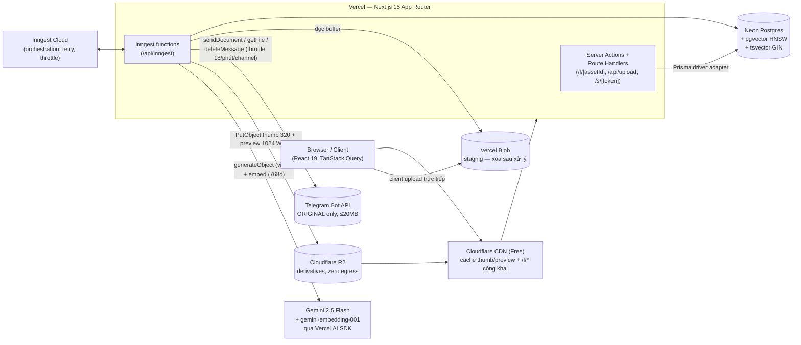

# 03 — SYSTEM ARCHITECTURE

# HuaCloud — Kiến trúc hệ thống

| | |
|---|---|
| **Sản phẩm** | HuaCloud |
| **Tác giả / Owner** | Hua Hưng |
| **Phiên bản tài liệu** | 1.0 |
| **Ngày cập nhật** | 2026-07-05 |
| **Bộ tài liệu** | [01 Vision](01_PROJECT_VISION.md) · [02 Product Requirements](02_PRODUCT_REQUIREMENTS.md) · [03 System Architecture](03_SYSTEM_ARCHITECTURE.md) · [04 Development Roadmap](04_DEVELOPMENT_ROADMAP.md) |

> Đây là tài liệu quan trọng nhất của bộ docs. Mọi dòng code viết trong 10–12 tuần tới phải nhất quán với tài liệu này. Mỗi quyết định đều kèm **lý do** — nếu sau này muốn đổi, phải phản biện được lý do gốc trước, và cập nhật lại tài liệu này.

---

## 1. Tổng quan kiến trúc

HuaCloud là **một monolith Next.js 15 duy nhất** deploy trên Vercel, với 4 dịch vụ managed xung quanh: Neon (Postgres + pgvector), Inngest Cloud (background jobs), Cloudflare R2 (derivatives), Telegram Bot API (original files). Cloudflare Free CDN đứng trước domain từ ngày đầu.

Nguyên tắc tổng thể:

1. **Telegram là cold storage ẩn** — chỉ giữ file gốc (ORIGINAL). Người dùng không bao giờ biết Telegram tồn tại. Gallery (hot path) **không bao giờ chạm Telegram** — thumb/preview serve từ R2 qua CDN.
2. **Mọi việc nặng chạy nền** — Sharp, upload Telegram, AI enrichment đều là Inngest steps, không chạy trong request path.
3. **Schema Postgres đầy đủ từ migration đầu tiên** — multi-tenant (Workspace), chunking (partIndex), multi-channel (StorageChannel), metering (UsageEvent) có sẵn trong schema dù UI V1 chưa dùng. Lý do: đây là những thứ đắt nhất để retrofit khi đã có data thật; chi phí bây giờ chỉ là vài chục dòng schema.
4. **Đường thoát thiết kế sẵn** — Next standalone + Postgres chuẩn + Inngest self-host + StorageDriver interface nghĩa là rời Vercel/Neon/Telegram đều là việc "thêm adapter / đổi connection string", không phải đập kiến trúc.



Luồng chính tóm tắt:

- **Upload:** client → Vercel Blob (staging) → Inngest pipeline → derivatives lên R2, original lên Telegram → Asset `READY`.
- **Xem gallery:** thumb/preview từ R2 → Cloudflare CDN → browser. Không hit Vercel function, không hit Telegram.
- **Tải original:** route proxy `/f/[assetId]` → resolve `tgFilePath` (cache 50 phút) → stream từ Telegram.
- **AI:** event `asset/enrich` → 1 call Gemini multimodal trên preview 1024px → caption/tags/OCR/objects/colors → embedding 768d vào pgvector.

---

## 2. Stack đầy đủ — vai trò, lý do chọn, phương án đã loại

| Công nghệ | Vai trò | Lý do chọn | Phương án đã loại & vì sao |
|---|---|---|---|
| **Next.js 15 App Router** (React 19, Server Components + Server Actions) | 1 codebase cho cả UI lẫn API | Hưng đã thành thạo → tốc độ ship cao nhất; RSC giảm JS bundle cho gallery lớn; Server Actions loại bỏ boilerplate API cho mutation nội bộ | SPA React + Express riêng: 2 codebase, 2 deploy, không đáng cho solo dev |
| **TypeScript strict** | An toàn kiểu toàn dự án | `strict: true` từ ngày đầu rẻ hơn bật sau; DTO suy từ Zod (`z.infer`) → 1 nguồn sự thật | — |
| **TailwindCSS + shadcn/ui + Framer Motion** | UI theo vision Apple/Linear, dark mode mặc định | shadcn là copy-paste component — own code, không lock-in; Framer Motion cho animation mượt | Component library đóng gói (MUI, Ant): khó đạt look "cao cấp tối giản", nặng bundle |
| **TanStack Query v5** (+ `@tanstack/react-virtual`) | Infinite scroll, cache client, optimistic update, polling trạng thái PROCESSING | `useInfiniteQuery` + virtualization là cách duy nhất render mượt hàng chục nghìn thumbnail | Websocket/real-time: polling status bằng React Query đủ tốt cho MVP, rẻ hơn nhiều |
| **Prisma 6 + PostgreSQL trên Neon** (bật pgvector) | DB chính: relational + vector search + full-text search trong 1 DB | Hưng quen MySQL → Prisma schema-first là cách học Postgres an toàn nhất; Neon free 0.5GB đủ ~100k asset; **Neon branch** cho phép test migration trước khi apply prod; pgvector + tsvector loại bỏ nhu cầu Elasticsearch/Pinecone | Vercel Postgres: free tier hẹp hơn, dính vendor Vercel. D1/SQLite: không có pgvector → mất AI search. MongoDB: search hybrid FTS+vector trên Postgres trưởng thành hơn |
| **Better Auth** (+ organization plugin) | Auth session, email/password + Google OAuth; organization plugin = Workspace | Self-host, lưu session trong Postgres, có sẵn multi-tenancy plugin → không tự chế RBAC | NextAuth: thiếu organization/API key plugin, cấu hình rườm rà hơn cho credentials. Basic Auth (repo cũ): không session, không revoke, CSRF — loại tuyệt đối |
| **Zod + React Hook Form** | Validation 1 nguồn: schema dùng chung client form ↔ server action ↔ job payload | Fail-fast; env validation lúc boot cũng bằng Zod | — |
| **Sharp** (+ `thumbhash`, `exif-reader`) | Image pipeline trong Inngest step (Node runtime) | Prebuilt binary chạy tốt trên Vercel serverless; thumbhash ~28 bytes lưu thẳng cột Postgres → blur placeholder không cần request | Server xử lý ảnh riêng / Cloudflare Images: thêm hạ tầng/chi phí khi Sharp-in-function đã đủ cho ảnh ≤20MB |
| **Inngest** | Queue, durable steps, retry, throttle, cron | Chạy ngay trên Vercel function — **không cần Redis, không cần worker 24/7**; throttle theo `tgChatId` + retry exponential backoff bằng config; free 50k runs/tháng; self-host được (đường thoát) | **BullMQ + Redis (P2/P3): loại** — đòi worker process 24/7 + Redis = thêm 2 mảnh hạ tầng phải vận hành, phá mô hình serverless. Vercel Cron + bảng Job tự viết: phải tự code retry/locking/backoff, sai nhiều edge case |
| **Vercel Blob** | Staging tạm lúc upload | Client upload thẳng lên Blob → né giới hạn **4.5MB request body** của Vercel function; file xóa ngay sau khi xử lý nên 1GB free là dư | Upload thẳng vào route handler: chết ở 4.5MB. tus resumable server: cần Node server long-running, không hợp serverless — để dành cho bản self-host |
| **Telegram Bot API** (fetch wrapper tự viết) | Cold storage cho ORIGINAL | Dung lượng miễn phí không giới hạn; chỉ cần 4 method: `sendDocument`, `getFile`, `deleteMessage`, `getMe` (healthcheck/verify token lúc boot) → fetch wrapper ~100 dòng, zero dependency | grammY/telegraf: kéo cả framework bot cho 4 method là thừa |
| **Cloudflare R2** | Derivatives: thumb 320px + preview 1024px WebP | **Zero egress fee** + free 10GB (100k ảnh × ~100KB ≈ vừa khít); gallery grid bắn hàng nghìn thumbnail request — hot path phải nhanh, không được dính rate limit/round-trip Telegram | **Thumbnail trên Telegram (P1 gốc): loại** — gallery hot path phụ thuộc Telegram + mỗi cache-miss tốn Vercel invocation. S3: egress fee. MinIO: cần VPS |
| **Vercel AI SDK** (`ai` + `@ai-sdk/google`) — Gemini 2.5 Flash + gemini-embedding-001 | AI enrichment + embedding | `generateObject` + Zod schema = structured output an toàn kiểu; free tier Gemini đủ MVP, tiếng Việt tốt; **swap provider = 1 dòng config** khi Google siết quota | Gọi `@google/genai` trực tiếp: hardcode vendor, tự viết interface swap là công sức thừa. **CLIP local (P2/P3): loại giai đoạn này** — ONNX không chạy trên Vercel serverless, text encoder tiếng Việt của CLIP chưa kiểm chứng; nâng cấp tương lai khi có worker riêng |
| **Cloudflare Free CDN** | Cache thumb/preview + `/f/*` công khai trước domain | Giảm bandwidth Vercel (100GB/tháng Hobby) + function invocations; chống hotlink kết hợp signed URL; $0 | Không CDN: chi phí serve phi tuyến khi có người dùng thật |

**Chi phí:** MVP $0. Lên Vercel Pro (~$20/tháng) ngay khi mở cho người ngoài dùng (Hobby cấm thương mại).

---

## 3. Cấu trúc thư mục `src/`

Feature-based + Clean Architecture. `app/` chỉ routing + composition; business logic nằm ở `server/services`; hạ tầng (Telegram, R2, Gemini) là driver/adapter phía sau interface.

```text
src/
├─ app/                              # CHỈ routing + composition — không chứa business logic
│  ├─ (marketing)/                   # landing page, pricing (public, SEO)
│  │  └─ page.tsx
│  ├─ (app)/                         # layout có auth guard (Better Auth session)
│  │  ├─ dashboard/  gallery/  albums/[albumId]/  search/
│  │  ├─ favorites/  shared/  trash/  settings/
│  │  └─ layout.tsx                  # app shell: sidebar, command-k, theme
│  ├─ (admin)/admin/                 # system admin: users, channels, queue health
│  ├─ s/[token]/                     # trang share công khai (ngoài auth)
│  ├─ f/[assetId]/route.ts           # serve original — proxy Telegram (mục 7)
│  └─ api/
│     ├─ upload/route.ts             # handleUpload của @vercel/blob/client
│     ├─ inngest/route.ts            # serve() các Inngest functions
│     ├─ auth/[...all]/route.ts      # Better Auth handler
│     └─ v1/                         # REST API public (API key) — Phase 4
├─ features/                         # mỗi feature tự chứa UI + logic phía client của nó
│  ├─ upload/     {components/, hooks/, actions.ts, schemas.ts}
│  ├─ gallery/    {components/, hooks/, actions.ts, queries.ts}
│  ├─ albums/     search/  share/  trash/  favorites/  settings/  admin/
│  └─ ai/         # UI: nút "Ảnh tương tự", panel AI metadata
├─ components/
│  ├─ ui/                            # shadcn primitives (button, dialog, ...)
│  └─ layout/                        # shell, sidebar, command palette
├─ server/                           # code server-only — file đầu import "server-only"
│  ├─ db/
│  │  ├─ client.ts                   # PrismaClient singleton (Neon adapter)
│  │  └─ search.ts                   # raw SQL: hybrid search, similar search
│  ├─ auth.ts                        # Better Auth config (+ organization plugin)
│  ├─ services/                      # business logic thuần — nơi DUY NHẤT đụng Prisma
│  │  ├─ asset.service.ts   album.service.ts   share.service.ts
│  │  ├─ search.service.ts  activity.service.ts  usage.service.ts
│  │  └─ apikey.service.ts
│  ├─ storage/                       # StorageDriver interface + drivers
│  │  ├─ types.ts                    # interface StorageDriver, PutResult
│  │  ├─ telegram/                   # client.ts, driver.ts, path-cache.ts
│  │  ├─ r2.driver.ts                # S3-compatible client cho derivatives
│  │  └─ staging.ts                  # Vercel Blob helpers (đường thoát: local-disk)
│  ├─ ai/
│  │  ├─ enrich.ts                   # generateObject + AiEnrichmentSchema
│  │  ├─ embedding.ts                # embed + L2 normalize
│  │  └─ prompts.ts
│  ├─ media/
│  │  ├─ process.ts                  # Sharp pipeline: thumb/preview/thumbhash
│  │  └─ exif.ts
│  ├─ inngest/
│  │  ├─ client.ts                   # Inngest client + event types (Zod)
│  │  └─ functions/                  # process-asset.ts, enrich-asset.ts,
│  │                                 # delete-asset.ts, purge-trash.ts, ...
│  └─ security/
│     ├─ signed-url.ts               # HMAC sign/verify (mục 7)
│     └─ rate-limit.ts
├─ lib/                              # utils isomorphic (được import cả 2 phía)
│  ├─ env.ts                         # Zod-validated env (fail-fast lúc boot)
│  ├─ schemas/                       # Zod schemas dùng chung: asset.ts, share.ts, ai.ts
│  └─ utils.ts
└─ types/                            # DTO types (z.infer) — không logic
prisma/
├─ schema.prisma
└─ migrations/                       # kể cả SQL tay: pgvector HNSW, tsvector (mục 4)
```

### Nguyên tắc phân lớp (bắt buộc)

```text
UI (app/, features/, components/)
   ↓ chỉ gọi
Server Actions / Route Handlers  (authn/authz + parse Zod → gọi service)
   ↓ chỉ gọi
server/services  (business logic, nơi duy nhất import Prisma, ghi Activity)
   ↓ chỉ gọi
Drivers: server/storage | server/ai | server/media  (adapter thuần, không biết Prisma)
```

1. Component **không bao giờ** import `prisma`, `server/storage/telegram`, hay bất kỳ thứ gì trong `server/` — chỉ gọi server actions/queries của feature.
2. Services **không import Next.js** (`next/*`) — để tái dùng nguyên vẹn trong Inngest functions và bản self-host.
3. Drivers không biết business logic — `TelegramDriver` nhận buffer trả `PutResult`, không biết Asset là gì.
4. Mọi mutation ghi `Activity` **trong cùng service call** (không rải rác ở UI).
5. Mọi file trong `server/` bắt đầu bằng `import "server-only"` — build fail ngay nếu UI lỡ import.

Lý do: repo cũ viết lại auth/copy/delete 3 lần ở 3 trang admin, logic trộn trong HTML — phân lớp này là thuốc chống tái phạm, và là điều kiện để Phase 6 (self-host) chỉ cần đổi driver.

---

## 4. Database schema (Prisma)

Đây là phần **đắt nhất để sửa sau** — migration đầu tiên phải đủ mọi model dưới đây, kể cả những bảng V1 chưa có UI (Workspace nhiều thành viên, ApiKey, UsageEvent, StorageChannel).

```prisma
// prisma/schema.prisma
generator client {
  provider        = "prisma-client-js"
  previewFeatures = ["driverAdapters", "postgresqlExtensions"]
}

datasource db {
  provider   = "postgresql"
  url        = env("DATABASE_URL")   // Neon pooled (pgbouncer)
  directUrl  = env("DIRECT_URL")     // Neon direct — dùng cho prisma migrate
  extensions = [vector, unaccent]
}

// ========== ENUMS ==========
enum WorkspaceRole {
  OWNER
  ADMIN
  MEMBER
  VIEWER
}

enum AssetKind {
  IMAGE
  VIDEO
  AUDIO
  DOCUMENT
}

enum AssetStatus {
  PENDING     // Asset đã tạo, file đang ở staging Blob
  PROCESSING  // Inngest pipeline đang chạy
  READY
  FAILED      // hết retry — UI hiện nút "Thử lại"
}

enum StorageBackend {
  TELEGRAM
  R2
}

enum PartVariant {
  ORIGINAL
  THUMB     // 320px WebP
  PREVIEW   // 1024px WebP
}

enum ChannelStatus {
  ACTIVE
  DEGRADED
  DISABLED
}

enum UsageMetric {
  UPLOAD_BYTES
  BANDWIDTH_BYTES
  STORAGE_BYTES
  AI_ENRICH
  API_REQUEST
}

// ========== AUTH (Better Auth) ==========
// Session/Account/Verification sinh bằng: npx @better-auth/cli generate
model User {
  id            String   @id @default(cuid())
  name          String?
  email         String   @unique
  emailVerified Boolean  @default(false)
  image         String?
  role          String   @default("user") // "user" | "admin" — admin cấp hệ thống
  createdAt     DateTime @default(now())
  updatedAt     DateTime @updatedAt

  memberships WorkspaceMember[]
  assets      Asset[]
  sessions    Session[]
  accounts    Account[]
}

model Session {
  id        String   @id @default(cuid())
  token     String   @unique
  userId    String
  expiresAt DateTime
  ipAddress String?
  userAgent String?
  createdAt DateTime @default(now())
  updatedAt DateTime @updatedAt
  user      User     @relation(fields: [userId], references: [id], onDelete: Cascade)

  @@index([userId])
}

model Account {
  id                    String    @id @default(cuid())
  userId                String
  accountId             String
  providerId            String    // "credential" | "google"
  accessToken           String?
  refreshToken          String?
  idToken               String?
  accessTokenExpiresAt  DateTime?
  refreshTokenExpiresAt DateTime?
  scope                 String?
  password              String?   // hash — Better Auth quản lý
  createdAt             DateTime  @default(now())
  updatedAt             DateTime  @updatedAt
  user                  User      @relation(fields: [userId], references: [id], onDelete: Cascade)

  @@index([userId])
}

model Verification {
  id         String   @id @default(cuid())
  identifier String
  value      String
  expiresAt  DateTime
  createdAt  DateTime @default(now())
  updatedAt  DateTime @updatedAt
}

// ========== MULTI-TENANT (ẩn ở V1 — mỗi user auto có 1 workspace lúc sign-up) ==========
model Workspace {
  id        String   @id @default(cuid())
  name      String
  slug      String   @unique
  plan      String   @default("free") // "free" | "pro" — dùng khi SaaS
  createdAt DateTime @default(now())
  updatedAt DateTime @updatedAt

  members     WorkspaceMember[]
  assets      Asset[]
  albums      Album[]
  shares      Share[]
  apiKeys     ApiKey[]
  activities  Activity[]
  usageEvents UsageEvent[]
}

model WorkspaceMember {
  workspaceId String
  userId      String
  role        WorkspaceRole @default(OWNER)
  createdAt   DateTime      @default(now())

  workspace Workspace @relation(fields: [workspaceId], references: [id], onDelete: Cascade)
  user      User      @relation(fields: [userId], references: [id], onDelete: Cascade)

  @@id([workspaceId, userId])
  @@index([userId])
}

// ========== STORAGE ==========
// Pool channel Telegram — V1 seed đúng 1 dòng từ TG_CHAT_ID.
// Scale ingest sau này = thêm dòng (rate limit Telegram ~20 msg/phút/channel).
model StorageChannel {
  id          String        @id @default(cuid())
  tgChatId    String        @unique
  label       String
  status      ChannelStatus @default(ACTIVE)
  priority    Int           @default(0)  // router chọn channel ACTIVE có priority cao, ít tải
  assetCount  Int           @default(0)
  lastErrorAt DateTime?
  createdAt   DateTime      @default(now())
}

model Asset {
  id             String      @id @default(cuid())
  workspaceId    String
  uploaderId     String
  kind           AssetKind
  status         AssetStatus @default(PENDING)
  fileName       String
  mimeType       String      // đã verify bằng magic bytes, KHÔNG tin browser
  size           Int         // bytes — MVP chặn 20MB nên Int đủ
  checksumSha256 String      // verify integrity + dedupe
  width          Int?
  height         Int?
  durationMs     Int?
  takenAt        DateTime?   // EXIF DateTimeOriginal — timeline view
  exif           Json?
  thumbhash      String?     // base64 ~28 bytes — blur placeholder, render không cần request
  dominantColor  String?     // hex, filter theo màu
  palette        Json?       // 5 màu chủ đạo [{hex, ratio}]
  aiCaption      String?     // tiếng Việt, Gemini sinh
  aiTags         String[]    @default([])
  ocrText        String?
  aiMeta         Json?       // {objects[], category, modelVersion}
  aiProcessedAt  DateTime?
  isFavorite     Boolean     @default(false)
  deletedAt      DateTime?   // soft delete — Trash 30 ngày rồi purge thật
  stagingUrl     String?     // Vercel Blob URL tạm — xóa khi READY
  errorMessage   String?
  createdAt      DateTime    @default(now())
  updatedAt      DateTime    @updatedAt

  // Cột thêm bằng migration SQL tay (xem ghi chú dưới):
  embedding Unsupported("vector(768)")?  // gemini-embedding-001, HNSW index
  searchTsv Unsupported("tsvector")?     // generated column, GIN index

  workspace Workspace    @relation(fields: [workspaceId], references: [id])
  uploader  User         @relation(fields: [uploaderId], references: [id])
  parts     StoragePart[]
  albums    AlbumAsset[]
  shares    Share[]

  @@index([workspaceId, deletedAt, createdAt(sort: Desc)]) // query gallery chính
  @@index([workspaceId, checksumSha256])                   // dedupe check
  @@index([workspaceId, status])                           // reconcile job
  @@index([workspaceId, isFavorite])
}

// Tách bảng parts NGAY TỪ ĐẦU:
// - partIndex: file >20MB sau này cắt chunk ≤18MB, mỗi chunk 1 dòng (part 0..n)
// - backend:   swap TELEGRAM → R2 cho original khi SaaS có doanh thu, không migrate phá
model StoragePart {
  id           String         @id @default(cuid())
  assetId      String
  variant      PartVariant
  partIndex    Int            @default(0)
  backend      StorageBackend
  size         Int
  // Backend TELEGRAM (variant ORIGINAL)
  tgChatId     String?
  tgMessageId  BigInt?        // BẮT BUỘC lưu — deleteMessage xóa thật được (repo cũ không lưu → không xóa được)
  tgFileId     String?
  tgFilePath   String?        // cache kết quả getFile — file_path Telegram sống ~1h
  tgFilePathAt DateTime?      // thời điểm cache — TTL 50 phút
  // Backend R2 (variant THUMB/PREVIEW)
  r2Key        String?        // "{workspaceId}/{assetId}/thumb.webp"
  createdAt    DateTime       @default(now())

  asset Asset @relation(fields: [assetId], references: [id], onDelete: Cascade)

  @@unique([assetId, variant, partIndex])
  @@index([tgFileId])
}

// ========== TỔ CHỨC ==========
model Album {
  id           String   @id @default(cuid())
  workspaceId  String
  name         String
  description  String?
  coverAssetId String?
  isSmart      Boolean  @default(false)
  smartQuery   Json?    // {q, tags[], dateRange, colors[]} — chạy lại search service, không materialize
  createdAt    DateTime @default(now())
  updatedAt    DateTime @updatedAt

  workspace Workspace    @relation(fields: [workspaceId], references: [id], onDelete: Cascade)
  assets    AlbumAsset[]

  @@index([workspaceId])
}

model AlbumAsset {
  albumId  String
  assetId  String
  position Int      @default(0)
  addedAt  DateTime @default(now())

  album Album @relation(fields: [albumId], references: [id], onDelete: Cascade)
  asset Asset @relation(fields: [assetId], references: [id], onDelete: Cascade)

  @@id([albumId, assetId])
  @@index([assetId])
}

// ========== CHIA SẺ / API / AUDIT / METERING ==========
model Share {
  id            String    @id @default(cuid())
  token         String    @unique // nanoid(12)
  workspaceId   String
  createdById   String
  assetId       String?   // share 1 asset...
  albumId       String?   // ...hoặc 1 album (đúng 1 trong 2 non-null — check ở service)
  passwordHash  String?   // bcrypt
  expiresAt     DateTime?
  maxDownloads  Int?
  downloadCount Int       @default(0)
  viewCount     Int       @default(0)
  allowDownload Boolean   @default(true)
  revokedAt     DateTime?
  createdAt     DateTime  @default(now())

  workspace Workspace @relation(fields: [workspaceId], references: [id], onDelete: Cascade)
  asset     Asset?    @relation(fields: [assetId], references: [id], onDelete: Cascade)

  @@index([workspaceId])
  @@index([expiresAt]) // share/expire cron
}

model ApiKey {
  id          String    @id @default(cuid())
  workspaceId String
  name        String
  prefix      String    // "hc_a1b2c3d8" — phần hiển thị UI để nhận diện key
  hashedKey   String    @unique // SHA-256(key) — KHÔNG lưu plaintext
  scopes      String[]  // "asset:read" | "asset:write" | "share:write" | ...
  lastUsedAt  DateTime?
  expiresAt   DateTime?
  revokedAt   DateTime?
  createdAt   DateTime  @default(now())

  workspace Workspace @relation(fields: [workspaceId], references: [id], onDelete: Cascade)

  @@index([workspaceId])
}

model Activity {
  id          String   @id @default(cuid())
  workspaceId String
  actorId     String?  // null = system (cron)
  actorType   String   @default("user") // "user" | "api_key" | "system"
  action      String   // "asset.upload" | "asset.delete" | "share.create" | "auth.login" ...
  targetType  String   // "asset" | "album" | "share" | "workspace" | "api_key"
  targetId    String
  meta        Json?
  ip          String?
  userAgent   String?
  createdAt   DateTime @default(now())

  workspace Workspace @relation(fields: [workspaceId], references: [id], onDelete: Cascade)

  @@index([workspaceId, createdAt(sort: Desc)])
  @@index([targetType, targetId])
}

model UsageEvent {
  id          String      @id @default(cuid())
  workspaceId String
  apiKeyId    String?
  metric      UsageMetric
  quantity    BigInt
  occurredAt  DateTime    @default(now())

  workspace Workspace @relation(fields: [workspaceId], references: [id], onDelete: Cascade)

  @@index([workspaceId, metric, occurredAt])
}
```

### SQL tay bắt buộc trong migration (commit vào `prisma/migrations/`)

Prisma không tự sinh được 3 thứ: HNSW index, generated column, immutable wrapper cho `unaccent`. Quy trình: khai báo cột `Unsupported(...)` trong schema (để Prisma không drop cột), chạy `prisma migrate dev --create-only`, rồi **sửa tay file migration** trước khi apply:

```sql
-- migration 0001_init (phần thêm tay)
CREATE EXTENSION IF NOT EXISTS vector;
CREATE EXTENSION IF NOT EXISTS unaccent;

-- unaccent() mặc định là STABLE, không dùng được trong generated column
-- → tạo wrapper IMMUTABLE (pattern chuẩn của Postgres):
CREATE OR REPLACE FUNCTION f_unaccent(text) RETURNS text
  LANGUAGE sql IMMUTABLE PARALLEL SAFE STRICT
  AS $$ SELECT public.unaccent('public.unaccent', $1) $$;

-- Sửa cột searchTsv mà Prisma sinh thành GENERATED COLUMN:
ALTER TABLE "Asset" DROP COLUMN IF EXISTS "searchTsv";
ALTER TABLE "Asset" ADD COLUMN "searchTsv" tsvector GENERATED ALWAYS AS (
  to_tsvector('simple', f_unaccent(
    coalesce("fileName", '') || ' ' ||
    coalesce("aiCaption", '') || ' ' ||
    coalesce("ocrText", '')  || ' ' ||
    array_to_string("aiTags", ' ')
  ))
) STORED;

CREATE INDEX "Asset_searchTsv_idx" ON "Asset" USING gin ("searchTsv");
CREATE INDEX "Asset_embedding_hnsw_idx" ON "Asset"
  USING hnsw (embedding vector_cosine_ops);
```

### Vì sao có các field/bảng "phòng xa"

| Thứ phòng xa | Chưa dùng ở V1 | Lý do phải có từ migration đầu |
|---|---|---|
| `Workspace` + `WorkspaceMember` | UI chỉ có 1 workspace mặc định/user | Thêm multi-tenancy **sau khi có data thật** là cuộc migrate đau nhất có thể gặp (mọi bảng phải thêm `workspaceId` + backfill + rewrite mọi query) |
| `StoragePart.partIndex` | Luôn = 0 (MVP chặn 20MB) | Chunking file >20MB thành part ≤18MB chỉ cần INSERT thêm dòng, không đổi schema |
| `StoragePart.backend` enum | Luôn TELEGRAM cho ORIGINAL | Telegram không SLA — đây là đường swap original sang R2 khi SaaS có doanh thu |
| `StorageChannel` | 1 dòng seed từ `TG_CHAT_ID` | Rate limit ~20 msg/phút/channel là trần cứng ingest; scale = thêm dòng, code router đã đọc từ bảng này từ đầu |
| `UsageEvent` | Chỉ ghi, chưa hiển thị | Metering trước, billing (Stripe) sau — không retrofit được số liệu quá khứ |
| `ApiKey` | Feature bật Phase 4 | Bảng có sẵn để REST API v1 không cần migration mới |

---

## 5. Telegram Storage Module

Toàn bộ nằm trong `src/server/storage/` — **phần còn lại của app không biết Telegram tồn tại**.

### 5.1. Interface `StorageDriver`

```ts
// src/server/storage/types.ts
import "server-only";

export type StoragePartRef = {
  backend: "TELEGRAM" | "R2";
  tgChatId?: string | null;
  tgFileId?: string | null;
  tgMessageId?: bigint | null;
  r2Key?: string | null;
};

export type PutResult = {
  backend: "TELEGRAM" | "R2";
  size: number;
  tgChatId?: string;
  tgFileId?: string;
  tgMessageId?: bigint;
  r2Key?: string;
};

export interface StorageDriver {
  put(input: {
    buffer: Buffer;
    fileName: string;
    mimeType: string;
  }): Promise<PutResult>;

  /** Stream bytes về — Telegram: qua getFile + fetch; R2: GetObject */
  get(ref: StoragePartRef): Promise<ReadableStream<Uint8Array>>;

  delete(ref: StoragePartRef): Promise<void>;

  /**
   * URL public trực tiếp nếu backend có (R2 qua CDN) — Telegram trả null
   * vì bot token không bao giờ được lộ ra URL client.
   */
  getPublicUrl(ref: StoragePartRef): string | null;
}
```

Hai implementation: `TelegramDriver` (ORIGINAL) và `R2Driver` (THUMB/PREVIEW). Service chọn driver theo `StoragePart.backend` — thêm backend mới (S3, local disk cho self-host) chỉ là thêm 1 file.

### 5.2. `TelegramDriver` chi tiết

```ts
// src/server/storage/telegram/client.ts — fetch wrapper thuần, KHÔNG retry ở tầng này
// (retry là việc của Inngest — tầng driver chỉ parse lỗi và throw có ngữ cảnh)
const API = `https://api.telegram.org/bot${env.TG_BOT_TOKEN}`;

export async function sendDocument(chatId: string, buffer: Buffer, fileName: string) {
  const form = new FormData();
  form.append("chat_id", chatId);
  form.append("document", new Blob([buffer]), fileName);
  const res = await fetch(`${API}/sendDocument`, { method: "POST", body: form });
  const data = await res.json();
  if (!data.ok) throw new TelegramError(data); // 429 → data.parameters.retry_after
  return {
    tgFileId: data.result.document.file_id as string,
    tgMessageId: BigInt(data.result.message_id),
  };
}

export async function getFile(fileId: string): Promise<string /* file_path */> { /* ... */ }
export async function deleteMessage(chatId: string, messageId: bigint): Promise<void> { /* ... */ }
```

Quy tắc cứng của driver:

1. **Luôn `sendDocument`, không bao giờ `sendPhoto`** — kể cả với ảnh. `sendPhoto` bị Telegram re-compress (mất bytes gốc, mất EXIF); DAM phải giữ nguyên 100% bytes để mọi derivative đều tái tạo được.
2. **Lưu đủ bộ ba `{tgFileId, tgMessageId, tgChatId}`** vào `StoragePart`. `tgMessageId` là điều kiện để `deleteMessage` xóa thật file trên Telegram khi purge Trash.
3. **`file_path` cache TTL 50 phút** (`path-cache.ts`): Telegram `file_path` sống ~1 giờ. `resolveFilePath(part)`: nếu `tgFilePathAt` < 50 phút → dùng cache trong DB; hết hạn → gọi `getFile` mới, `UPDATE StoragePart SET tgFilePath, tgFilePathAt`. Khi fetch file trả 404 (race hiếm: path chết giữa TTL) → **retry đúng 1 lần** với `getFile` tươi.
4. **Giới hạn 20MB chặn cứng ở MVP** (Zod cả client lẫn `handleUpload`): Bot API upload được 50MB nhưng `getFile` chỉ **tải về** được ≤20MB — file >20MB upload được mà không serve được là bẫy tệ nhất. Đường mở sau: chunk ≤18MB/part qua `partIndex`, serve bằng stream nối part tuần tự, verify `checksumSha256` sau ghép (Phase 6, chỉ khi có nhu cầu thật).
5. **Multi-channel qua `StorageChannel`**: hàm `pickChannel()` chọn channel `ACTIVE` có priority cao nhất/ít tải nhất. V1 chỉ có 1 channel nhưng code đọc từ bảng ngay từ đầu — thêm throughput = INSERT thêm channel.
6. **Throttle + retry nằm ở Inngest, không ở driver**: function `process-asset` config `throttle: { limit: 18, period: "1m", key: "event.data.tgChatId" }` (Telegram cho ~20 msg/phút/channel, chừa margin) và `retries: 4` backoff mũ; lỗi 429 → `throw new RetryAfterError(msg, retry_after)`.

### 5.3. Pattern học từ repo cũ — và những gì sửa

| Repo gốc (Telegraph-Image) làm | Vấn đề | HuaCloud sửa |
|---|---|---|
| `getFile` **mỗi request** serve (không cache gì) | 2 round-trip Telegram cho mỗi lượt xem | `tgFilePath` cache 50 phút trong DB + retry 1 lần khi 404 + `Cache-Control immutable` để CDN gánh |
| Ảnh upload qua `sendPhoto` (chọn size lớn nhất trong `photo[]`) | Telegram nén ảnh — mất bytes gốc, mất EXIF | `sendDocument` cho mọi file |
| Không lưu `message_id` | "Delete" chỉ xóa record KV — file sống vĩnh viễn trên Telegram, record còn tự tái tạo khi truy cập lại | Lưu `tgMessageId` → purge Trash gọi `deleteMessage` xóa thật |
| Không validate file (extension lấy thẳng từ tên file, tin MIME browser) | Bề mặt tấn công + data rác | Magic bytes validation (package `file-type`) + Zod, MIME lưu DB là MIME đã verify |
| Retry tự chế trong handler (fallback sendPhoto→sendDocument, sleep 1s×n) | Logic retry trộn vào business code, không durable | Retry/backoff/throttle là **config Inngest**, mỗi step durable độc lập |
| KV write mỗi lượt xem (put metadata lại ở cuối serve) | Chi phí + giới hạn 1 write/giây/key | Serve path là read-only; counter (viewCount) chỉ tăng ở route share qua service |
| Hardcode Sentry DSN + trackers của tác giả gốc | Leak dữ liệu ra ngoài | Không mang theo gì — observability tự chọn (Vercel Analytics + Sentry DSN riêng nếu cần) |

---

## 6. Luồng upload end-to-end

```mermaid
sequenceDiagram
    autonumber
    participant C as Client (React Hook Form + Zod)
    participant UP as /api/upload (route handler)
    participant B as Vercel Blob (staging)
    participant DB as Neon Postgres
    participant IN as Inngest: process-asset
    participant R2 as Cloudflare R2
    participant TG as Telegram Bot API

    C->>UP: handleUpload — authn session + Zod (≤20MB, type allowlist)
    UP-->>C: client upload token
    C->>B: upload trực tiếp từng file (multipart, progress bar thật)
    B->>UP: onUploadCompleted callback
    UP->>DB: INSERT Asset {status: PENDING, stagingUrl, fileName, size}
    UP->>IN: inngest.send("asset/uploaded", {assetId, tgChatId})
    Note over IN: throttle 18/phút theo tgChatId · retries 4 (backoff mũ)
    IN->>DB: step "mark-processing" — status = PROCESSING
    IN->>B: step "fetch-staging" — tải buffer từ Blob
    IN->>IN: step "validate" — magic bytes (file-type), sửa mimeType/kind
    IN->>DB: step "checksum" — sha256; nếu trùng (workspaceId, checksumSha256)<br/>→ link parts của asset cũ, bỏ qua bước Telegram (dedupe)
    IN->>IN: step "derive" — Sharp: thumb 320 WebP, preview 1024 WebP,<br/>thumbhash, EXIF (takenAt), dominantColor + palette
    IN->>R2: step "put-derivatives" — thumb.webp + preview.webp
    IN->>TG: step "put-original" — sendDocument (giữ nguyên bytes)
    IN->>DB: step "finalize" — INSERT StoragePart ×3, Asset = READY
    IN->>B: step "cleanup" — del(stagingUrl)
    IN->>IN: nếu có GEMINI_API_KEY → send "asset/enrich"
```

Chi tiết từng khâu:

- **Client**: `react-dropzone` (drag-drop, chọn thư mục) + paste `Ctrl+V`; queue upload theo file, mỗi file 1 lần `upload()` của `@vercel/blob/client` → progress thật per-file. Zod validate trước khi gửi: `size ≤ 20 * 1024 * 1024`, extension allowlist.
- **Vì sao staging Blob**: Vercel serverless chặn request body 4.5MB — client upload thẳng lên Blob (signed bởi `handleUpload`) là cách chuẩn để né. Blob chỉ là bến tạm: file bị xóa ở step cuối, 1GB free là dư.
- **Validate magic bytes** (`file-type`): không tin `File.type` của browser. Kết quả quyết định `Asset.kind` + `mimeType` lưu DB. File không nằm trong allowlist → Asset `FAILED` + lý do.
- **Dedupe**: `sha256` buffer; nếu `(workspaceId, checksumSha256)` đã có asset `READY` → tạo Asset mới trỏ tới cùng `StoragePart` data (copy dòng part, không re-upload Telegram). Tiết kiệm cả bandwidth lẫn quota channel.
- **Mỗi step là durable step của Inngest** (`step.run`): step nào fail chỉ retry step đó — không upload lại Telegram vì Sharp lỗi. Hết 4 lần retry → function `onFailure` set Asset `FAILED` + `errorMessage` + ghi Activity; UI hiện nút "Thử lại" (re-send event).
- **Reconcile**: cron `reconcile-assets` (mục 9) quét asset kẹt `PENDING/PROCESSING` >30 phút → re-send event hoặc mark `FAILED`. Đây là lưới an toàn khi Inngest miss event hoặc deploy giữa chừng — không mất dữ liệu vì Blob còn giữ file.

Trạng thái Asset — một chiều, không quay lui:

```text
PENDING ──▶ PROCESSING ──▶ READY
                 │
                 └────────▶ FAILED ──(user bấm retry / reconcile)──▶ PENDING
```

---

## 7. Luồng serve 3 tầng + signed URL

| Tầng | Nội dung | Đường đi | Cache |
|---|---|---|---|
| **1. Thumb/Preview** (hot path — gallery, lightbox) | WebP từ R2 | Browser → Cloudflare CDN → R2 public bucket (custom domain `cdn.` hoặc R2 public URL). **Không hit Vercel, không hit Telegram** | CDN edge + browser: `public, max-age=31536000, immutable` (r2Key bất biến — nội dung đổi thì key đổi) |
| **2. Original private** (download, xem gốc) | Proxy qua `GET /f/[assetId]` | Route handler: check session + workspace membership → `resolveFilePath` (cache 50 phút) → fetch `api.telegram.org/file/bot…/{file_path}` → stream passthrough | `private, max-age=3600`; `tgFilePath` cache DB 50 phút; retry 1 lần khi Telegram 404 |
| **3. Original/preview qua share công khai** | `GET /f/[assetId]?v=original&exp=...&sig=...` | Signed URL HMAC — CDN cache được mà **không hit auth mỗi request** | `public, max-age=<exp còn lại>, immutable` — Cloudflare gánh gần hết lượt xem |

Ghi chú: bot token **không bao giờ** xuất hiện trong URL trả về client — mọi fetch tới `api.telegram.org` xảy ra server-side trong route handler.

### Signed URL design

- Payload ký: `"{assetId}:{variant}:{exp}"` — `exp` là unix seconds.
- Thuật toán: HMAC-SHA256 với `SIGNING_SECRET` (server-side only, ≥32 bytes random).
- Verify **constant-time** (`crypto.timingSafeEqual`) — so sánh chuỗi thường bị timing attack.
- Trang share `/s/[token]` render xong mới phát signed URL (sau khi check password/expiry/revoked/maxDownloads của `Share`); TTL signed URL ngắn (~1 giờ) và gia hạn khi user còn ở trang.

```ts
// src/server/security/signed-url.ts
import "server-only";
import { createHmac, timingSafeEqual } from "node:crypto";

const SECRET = process.env.SIGNING_SECRET!;

export function signAssetUrl(assetId: string, variant: "original" | "preview", ttlSeconds = 3600) {
  const exp = Math.floor(Date.now() / 1000) + ttlSeconds;
  const sig = createHmac("sha256", SECRET)
    .update(`${assetId}:${variant}:${exp}`)
    .digest("base64url");
  return `/f/${assetId}?v=${variant}&exp=${exp}&sig=${sig}`;
}

export function verifyAssetSig(assetId: string, variant: string, exp: number, sig: string): boolean {
  if (!Number.isFinite(exp) || exp < Date.now() / 1000) return false;
  const expected = createHmac("sha256", SECRET)
    .update(`${assetId}:${variant}:${exp}`)
    .digest();
  let given: Buffer;
  try { given = Buffer.from(sig, "base64url"); } catch { return false; }
  return given.length === expected.length && timingSafeEqual(given, expected);
}
```

Route `/f/[assetId]/route.ts` — thứ tự check: (1) có `sig` hợp lệ → serve public-cacheable; (2) không có `sig` → require session + membership → serve private. Response headers: `Content-Type` từ DB (đã verify), `Content-Disposition: inline; filename=...`, `ETag: checksumSha256`.

---

## 8. AI Pipeline

Nguyên tắc: **AI degrade gracefully** — thiếu `GEMINI_API_KEY` thì app vẫn là DAM đầy đủ (search FTS theo tên file/OCR trống, không caption). Không feature nào của core phụ thuộc AI.

### 8.1. Enrichment — Inngest function `enrich-asset`

Trigger: event `asset/enrich` (bắn sau khi Asset `READY`, nếu có key). Config: `retries: 3`, `throttle: { limit: 10, period: "1m" }` (khớp RPM free tier Gemini).

**1 call multimodal duy nhất** trên **preview 1024px** (không gửi original — rẻ và đủ):

```ts
// src/lib/schemas/ai.ts — Zod schema là contract, generateObject bảo đảm shape
import { z } from "zod";

export const AiEnrichmentSchema = z.object({
  caption: z.string().describe("Mô tả ảnh bằng tiếng Việt, 1-2 câu, tự nhiên"),
  tags: z.array(z.string()).min(3).max(15)
    .describe("Tag tiếng Việt không dấu hóa lowercase, vd: 'ao so mi', 'hoa don'"),
  ocrText: z.string().default("").describe("Toàn bộ chữ đọc được trong ảnh, giữ nguyên ngôn ngữ"),
  objects: z.array(z.string()).default(“”.split?.length ? [] : []).describe("Vật thể chính trong ảnh"),
  colors: z.array(z.string()).max(5).default([]).describe("Màu chủ đạo, tên tiếng Việt"),
});
export type AiEnrichment = z.infer<typeof AiEnrichmentSchema>;
```

```ts
// src/server/ai/enrich.ts
import { generateObject } from "ai";
import { google } from "@ai-sdk/google";
import { AiEnrichmentSchema } from "@/lib/schemas/ai";

export async function enrichImage(previewBuffer: Buffer) {
  const { object } = await generateObject({
    model: google("gemini-2.5-flash"),
    schema: AiEnrichmentSchema,
    messages: [{
      role: "user",
      content: [
        { type: "image", image: previewBuffer },
        { type: "text", text:
          "Phân tích ảnh này cho hệ thống quản lý tài nguyên số. " +
          "Caption ngắn gọn tiếng Việt. Tags phục vụ tìm kiếm. " +
          "OCR đầy đủ nếu ảnh có chữ (hóa đơn, tài liệu, screenshot)." },
      ],
    }],
  });
  return object; // ghi vào aiCaption, aiTags, ocrText, aiMeta.objects, palette đối chiếu
}
```

Swap provider khi Google siết quota = đổi `google("gemini-2.5-flash")` thành `openai("gpt-5-mini")` — 1 dòng, schema giữ nguyên. Đây chính là lý do chọn Vercel AI SDK thay vì gọi `@google/genai` trực tiếp.

### 8.2. Embedding

Embed **chuỗi tổng hợp** `"{aiCaption}\n{aiTags.join(' ')}\n{ocrText}\n{fileName}"` bằng `gemini-embedding-001`, 768 dimensions:

```ts
// src/server/ai/embedding.ts
import { embed } from "ai";
import { google } from "@ai-sdk/google";

export async function embedText(text: string, kind: "doc" | "query") {
  const { embedding } = await embed({
    model: google.textEmbedding("gemini-embedding-001"),
    value: text.slice(0, 8000),
    providerOptions: {
      google: {
        outputDimensionality: 768,
        taskType: kind === "doc" ? "RETRIEVAL_DOCUMENT" : "RETRIEVAL_QUERY",
      },
    },
  });
  // QUAN TRỌNG: output ≠ 3072 dims KHÔNG được unit-normalize sẵn
  // → phải normalize L2 trước khi lưu, vì HNSW index dùng cosine distance
  const norm = Math.sqrt(embedding.reduce((s, v) => s + v * v, 0));
  return embedding.map((v) => v / norm);
}
```

Ghi vào DB bằng raw SQL (Prisma chưa hỗ trợ vector):

```ts
await prisma.$executeRaw`
  UPDATE "Asset" SET "embedding" = ${`[${vec.join(",")}]`}::vector
  WHERE "id" = ${assetId}`;
```

### 8.3. Hybrid search — FTS + vector, merge bằng Reciprocal Rank Fusion

`search.service.ts` chạy 2 nhánh trong **1 query** rồi merge. RRF: `score(d) = Σ 1/(k + rank_i(d))`, `k = 60` (hằng số chuẩn trong literature):

```sql
-- src/server/db/search.ts ($queryRaw, params: $1=query text, $2=workspaceId, $3=query embedding)
WITH fts AS (
  SELECT id, row_number() OVER (
           ORDER BY ts_rank("searchTsv", websearch_to_tsquery('simple', f_unaccent($1))) DESC
         ) AS rank
  FROM "Asset"
  WHERE "workspaceId" = $2 AND "deletedAt" IS NULL
    AND "searchTsv" @@ websearch_to_tsquery('simple', f_unaccent($1))
  LIMIT 50
),
vec AS (
  SELECT id, row_number() OVER (ORDER BY "embedding" <=> $3::vector) AS rank
  FROM "Asset"
  WHERE "workspaceId" = $2 AND "deletedAt" IS NULL AND "embedding" IS NOT NULL
  ORDER BY "embedding" <=> $3::vector
  LIMIT 50
)
SELECT id, SUM(1.0 / (60 + rank)) AS rrf_score
FROM (SELECT * FROM fts UNION ALL SELECT * FROM vec) merged
GROUP BY id
ORDER BY rrf_score DESC
LIMIT 30;
```

- Filter thời gian ("tháng 6") parse phía service (regex/chrono-node) → thêm `AND ("takenAt" ... OR "createdAt" ...)` trước khi rank — **không cần LLM trong đường search** → nhanh, $0.
- Không có `GEMINI_API_KEY` → chỉ chạy nhánh `fts` (degrade).
- **"Tìm ảnh tương tự"**: query pgvector bằng embedding của chính asset — similarity theo ngữ nghĩa mô tả, đủ tốt cho DAM:

```sql
SELECT id FROM "Asset"
WHERE "workspaceId" = $1 AND "deletedAt" IS NULL AND id <> $2 AND "embedding" IS NOT NULL
ORDER BY "embedding" <=> (SELECT "embedding" FROM "Asset" WHERE id = $2)
LIMIT 24;
```

- CLIP cross-modal local (image encoder thật) là **nâng cấp tương lai** khi có worker riêng — không chạy được trên Vercel serverless, và chất lượng text encoder tiếng Việt chưa kiểm chứng. Đường search qua caption tiếng Việt do Gemini sinh là đường chắc chắn hoạt động.

---

## 9. Background jobs — danh sách Inngest functions

Tất cả đăng ký qua `serve()` tại `/api/inngest`. Event payload validate bằng Zod trong `server/inngest/client.ts`.

| Function id | Trigger | Steps chính | Retry | Throttle/Concurrency |
|---|---|---|---|---|
| `process-asset` | event `asset/uploaded` | mark-processing → fetch-staging → validate magic bytes → sha256 dedupe → Sharp derive → put R2 → sendDocument Telegram → finalize READY → cleanup Blob → bắn `asset/enrich` | 4, exponential backoff; 429 → `RetryAfterError(retry_after)`; `onFailure` → Asset FAILED + Activity | `throttle: {limit: 18, period: "1m", key: "event.data.tgChatId"}` |
| `enrich-asset` | event `asset/enrich` | fetch preview R2 → generateObject Gemini → update aiCaption/aiTags/ocrText/aiMeta → embed 768d → UPDATE embedding → ghi UsageEvent(AI_ENRICH) | 3 | `throttle: {limit: 10, period: "1m"}` (RPM Gemini free) |
| `delete-asset` | event `asset/delete` (hard delete từ Trash hoặc purge) | deleteMessage từng part TELEGRAM → DeleteObject từng part R2 → xóa row Asset (cascade parts) → Activity | 4 | throttle theo `tgChatId` (deleteMessage cũng tính rate limit) |
| `purge-trash` | cron `0 3 * * *` (hằng ngày 3h) | query Asset `deletedAt < now() - 30d` → bắn `asset/delete` từng batch 50 | 2 | — |
| `expire-shares` | cron `0 * * * *` (hằng giờ) | `UPDATE Share SET revokedAt = now()` cho share `expiresAt < now()` hoặc `downloadCount >= maxDownloads` → Activity | 2 | — |
| `reconcile-assets` | cron `*/30 * * * *` | quét Asset kẹt PENDING/PROCESSING >30 phút → re-send `asset/uploaded` (Blob còn file) hoặc mark FAILED; sample 20 part TELEGRAM gọi `getFile` verify còn sống → channel lỗi liên tục → `StorageChannel.status = DEGRADED` + Activity | 2 | — |
| `backup-export` | cron `0 4 * * 0` (tuần) + event `backup/requested` (user bấm) | export metadata JSON (Asset/Album/Share) + stream originals từ Telegram → zip từng batch → put R2 bucket `hc-backup/` → Activity | 3 | throttle theo `tgChatId` (đọc getFile hàng loạt) |

Lý do đúc kết: mọi tương tác Telegram (kể cả delete và backup) đều đi qua Inngest để hưởng chung throttle theo channel — không bao giờ có 2 code path đua nhau ăn rate limit.

---

## 10. Bảo mật

### 10.1. Auth flow — Better Auth

- Email/password + Google OAuth; session cookie (`httpOnly`, `secure`, `sameSite=lax`) lưu bảng `Session`.
- Sign-up hook: auto tạo `Workspace` cá nhân + `WorkspaceMember{role: OWNER}` trong cùng transaction.
- Organization plugin bật sẵn ở config nhưng UI V1 không lộ — nền cho Workspace nhiều thành viên Phase 6.

### 10.2. Bảo vệ route

- `middleware.ts` (edge): route group `(app)` và `(admin)` — không có session cookie → redirect `/sign-in`. Middleware chỉ là lớp UX; **authz thật nằm ở server**.
- Mỗi server action/route handler: `const session = await auth.api.getSession(...)` → build `ctx = { userId, workspaceId, role }` → truyền vào service. `(admin)` check thêm `User.role === "admin"`.

### 10.3. RBAC trong services

- Mọi hàm service nhận `ctx` làm tham số đầu; helper `can(ctx, "asset.delete")` map từ `WorkspaceRole` (OWNER > ADMIN > MEMBER > VIEWER — enum đủ dùng, không bảng Permission riêng ở MVP).
- **Mọi query Prisma trong service bắt buộc filter `workspaceId: ctx.workspaceId`** — quy ước review: query nào không có `workspaceId` trong `where` phải có comment giải thích.

### 10.4. API key (Phase 4)

- Format: `hc_live_<32 ký tự nanoid>`; hiển thị **1 lần duy nhất** lúc tạo.
- Lưu `hashedKey = SHA-256(key)` + `prefix` (nhận diện UI). Verify: hash key nhận được → lookup `@unique hashedKey` → check `revokedAt/expiresAt/scopes`.
- Scopes dạng chuỗi `"asset:read" | "asset:write" | "share:write"` — REST API v1 check scope trước khi vào service.

### 10.5. Rate limit

- **Tầng 1 — Cloudflare Free** (trước domain): rate limiting rule cho `/api/*` và `/f/*` + bot fight mode. Đây là lớp chịu tải volumetric, $0.
- **Tầng 2 — app-level** (`server/security/rate-limit.ts`): fixed-window counter trên Postgres (`UsageEvent` + đếm theo cửa sổ phút) cho API key và các mutation nhạy cảm (login attempt, tạo share). Không dùng Redis ở giai đoạn Vercel — đúng quyết định kiến trúc; nếu cần chính xác hơn khi SaaS, nâng lên sliding window vẫn trên Postgres.

### 10.6. Upload validation

- Zod: size ≤ 20MB, tên file sanitize, extension allowlist — chạy cả client lẫn `handleUpload` (server là nguồn sự thật).
- **Magic bytes** (`file-type`) trong Inngest step — không tin MIME của browser (repo cũ tin hoàn toàn, đã ghi nhận là rủi ro). MIME/kind lưu DB là kết quả verify.

### 10.7. CSRF / XSS / CSP

- Mutation chỉ qua Server Actions (Next.js tự có origin check) hoặc POST route handler — **không bao giờ mutation bằng GET** (lỗi CSRF nghiêm trọng nhất của repo cũ).
- Không dùng `dangerouslySetInnerHTML` với dữ liệu user (repo cũ có `v-html` trên metadata — bề mặt XSS).
- CSP headers trong `next.config.ts`:

```ts
const securityHeaders = [
  { key: "Content-Security-Policy",
    value: "default-src 'self'; img-src 'self' data: blob: https://cdn.<domain>; " +
           "script-src 'self' 'unsafe-inline'; style-src 'self' 'unsafe-inline'; " +
           "frame-ancestors 'none'" },
  { key: "X-Content-Type-Options", value: "nosniff" },
  { key: "Referrer-Policy", value: "strict-origin-when-cross-origin" },
  { key: "X-Frame-Options", value: "DENY" },
];
```

### 10.8. Audit log — `Activity` ghi gì

| Nhóm | Actions |
|---|---|
| Auth | `auth.login`, `auth.logout`, `auth.failed_login` (kèm ip) |
| Asset | `asset.upload`, `asset.delete` (soft), `asset.purge` (hard), `asset.restore`, `asset.rename`, `asset.reprocess` |
| Album | `album.create/update/delete`, `album.add_assets/remove_assets` |
| Share | `share.create/revoke`, `share.password_failed`, `share.download` |
| API/Workspace | `api_key.create/revoke`, `workspace.member_invite/remove`, `backup.export` |

Mỗi record: `actorType/actorId`, `targetType/targetId`, `meta` (diff gọn), `ip`, `userAgent`. Append-only — không API sửa/xóa Activity.

---

## 11. Deploy

### 11.1. Deploy chính: Vercel + Neon + Inngest Cloud + R2 + Cloudflare

Thứ tự setup (Phase 0):

1. **Neon**: tạo project → copy `DATABASE_URL` (pooled) + `DIRECT_URL` → `CREATE EXTENSION vector;` chạy trong migration đầu. Tạo branch `dev` để test migration.
2. **Repo GitHub mới** (fresh history — xem mục 12) → import vào **Vercel** → framework Next.js tự nhận → thêm env vars (bảng dưới).
3. **Vercel Blob**: bật store trong Vercel dashboard → `BLOB_READ_WRITE_TOKEN` tự inject.
4. **Cloudflare R2**: tạo bucket `huacloud-derived` → API token (Object Read/Write) → gắn custom domain `cdn.<domain>` cho bucket (để CDN cache được với cache rules).
5. **Inngest Cloud**: tạo app → sync endpoint `https://<domain>/api/inngest` → copy `INNGEST_EVENT_KEY` + `INNGEST_SIGNING_KEY`.
6. **Telegram**: tạo bot qua @BotFather → tạo private channel → add bot làm admin → lấy `TG_CHAT_ID` → seed 1 dòng `StorageChannel`.
7. **Cloudflare DNS**: domain trỏ Vercel qua CNAME, bật proxy (orange cloud); cache rule cho `cdn.<domain>` và `/f/*` có query `sig`.
8. **Gemini** (optional): lấy key tại AI Studio → set `GEMINI_API_KEY`. Không set → AI features tự ẩn.

### 11.2. Bảng env vars

Validate toàn bộ bằng Zod trong `src/lib/env.ts` — thiếu var bắt buộc thì fail ngay lúc boot, không chết ngầm lúc runtime (bài học từ repo cũ: thiếu `BASIC_USER` → admin mở toang không cảnh báo).

| Env var | Bắt buộc | Dùng cho | Ghi chú |
|---|---|---|---|
| `DATABASE_URL` | ✅ | Prisma runtime (Neon pooled, pgbouncer) | `postgresql://...-pooler.../huacloud?sslmode=require` |
| `DIRECT_URL` | ✅ | `prisma migrate` (kết nối direct) | Neon direct endpoint |
| `BETTER_AUTH_SECRET` | ✅ | Ký session Better Auth | ≥32 bytes random (`openssl rand -base64 32`) |
| `BETTER_AUTH_URL` | ✅ | Base URL cho auth callback | `https://<domain>` |
| `NEXT_PUBLIC_APP_URL` | ✅ | Client build URL tuyệt đối (share link, QR) | `https://<domain>` |
| `TG_BOT_TOKEN` | ✅ | Telegram Bot API | Từ @BotFather — không bao giờ ra client |
| `TG_CHAT_ID` | ✅ | Channel mặc định — seed `StorageChannel` | Bot phải là admin channel |
| `BLOB_READ_WRITE_TOKEN` | ✅ | Vercel Blob staging | Vercel tự inject khi bật store |
| `R2_ACCOUNT_ID` | ✅ | Endpoint S3 `https://<account>.r2.cloudflarestorage.com` | |
| `R2_ACCESS_KEY_ID` / `R2_SECRET_ACCESS_KEY` | ✅ | R2 S3 API credentials | Token scope tối thiểu: 1 bucket |
| `R2_BUCKET` | ✅ | Tên bucket derivatives | `huacloud-derived` |
| `R2_PUBLIC_BASE_URL` | ✅ | Base URL public cho thumb/preview | `https://cdn.<domain>` |
| `SIGNING_SECRET` | ✅ | HMAC signed URL (mục 7) | ≥32 bytes random, khác BETTER_AUTH_SECRET |
| `INNGEST_EVENT_KEY` | ✅ | Gửi event lên Inngest Cloud | |
| `INNGEST_SIGNING_KEY` | ✅ | Verify request từ Inngest vào `/api/inngest` | |
| `GEMINI_API_KEY` | ⬜ | AI enrichment + embedding | Không set → AI degrade, app vẫn đủ DAM |
| `AI_GATEWAY_API_KEY` | ⬜ | Thay thế khi route qua Vercel AI Gateway | Chọn 1 trong 2 đường gọi model |

### 11.3. Đường thoát (Phase 6) — docker-compose + local Bot API

Đã thiết kế sẵn, **chỉ kích hoạt khi có nhu cầu thật** (file >20MB, thoát chi phí Vercel, hoặc bán bản self-host):

- `docker-compose.yml`: `app` (Next.js `output: "standalone"`), `postgres` (image `pgvector/pgvector:pg16`), `inngest` (self-host binary — cùng SDK, không đổi code function), `caddy` (auto HTTPS), optional `telegram-bot-api` (local Bot API server chính chủ Telegram — gỡ giới hạn `getFile` 20MB, upload tới 2GB, `file_path` là đường dẫn disk local).
- Những thứ khiến việc chuyển này rẻ: Postgres chuẩn (dump/restore từ Neon), Inngest functions giữ nguyên, `StorageDriver`/staging là interface (Blob → local disk = 1 driver mới), business logic không import Next.js.

### 11.4. Backup strategy (rủi ro gốc: mất Postgres = mất mapping `file_id` → file trên Telegram thành rác vĩnh viễn)

1. **Neon PITR** (built-in, free tier giữ ~24h history) — lớp phòng lỗi thao tác tức thời.
2. **pg_dump định kỳ** — GitHub Actions cron hằng đêm: `pg_dump $DIRECT_URL | gzip` → upload R2 bucket `huacloud-backup/` (giữ 14 bản). Nằm ngoài Vercel/Inngest vì cần binary `pg_dump`.
3. **Export/Backup trong app** (Phase 3 — **không phải cuối roadmap**): function `backup-export` (mục 9) cho user tải zip về máy hoặc đẩy R2 — đường lui dữ liệu phải có **trước khi mời người khác dùng**, vì Telegram không có SLA.

---

## 12. License cho HuaCloud

| Lựa chọn | Ưu | Nhược |
|---|---|---|
| **Private (không license)** | Giữ toàn quyền, không lo clone khi còn định hướng SaaS | Không dùng làm portfolio public được |
| **MIT khi public** | Chuẩn portfolio, ai cũng hiểu, không rào cản người xem/đóng góp | Ai cũng fork và thương mại hóa được |
| AGPL-3.0 | Chống cloud provider clone | Dọa người dùng doanh nghiệp, quá nặng cho mục tiêu portfolio |

**Quyết định:** repo **private trong suốt quá trình phát triển**; khi sản phẩm đạt chất lượng portfolio (cuối Phase 6) → public với **MIT**. Nếu lúc đó SaaS có tín hiệu doanh thu thật, giữ private phần deploy config và public phần core. Về phía repo gốc: Telegraph-Image dùng **CC0 1.0** (public domain dedication) — rebrand + thương mại hóa hợp lệ, không cần attribution; lưu ý duy nhất là không dùng tên/logo "Telegraph-Image" (trademark không được waive — ta rebrand nên không ảnh hưởng).

---

## 13. Architecture Decision Records (rút gọn)

| # | Quyết định | Lựa chọn | Lý do chính | Hệ quả chấp nhận |
|---|---|---|---|---|
| ADR-01 | Background jobs | **Inngest** (loại BullMQ + Redis) | BullMQ đòi worker 24/7 + Redis = 2 mảnh hạ tầng phải vận hành, phá serverless; Inngest cho durable steps + throttle theo `tgChatId` + retry backoff bằng config, free 50k runs/tháng, self-host được | Thêm vendor thứ 3 trong critical path; Inngest sập → upload treo ở staging (không mất data, replay được) |
| ADR-02 | Deploy chính | **Vercel + Neon + R2 + Inngest Cloud** (loại VPS Docker) | Hưng mạnh frontend/Vercel, chưa có kinh nghiệm vận hành VPS/backup/monitoring; chi phí MVP $0; tiêu chí thành bại là "sống sót qua tháng thứ 2" chứ không phải kiến trúc đẹp nhất | Vercel Pro $20/tháng khi mở cho người ngoài; giữ docker-compose + Next standalone làm đường thoát Phase 6 |
| ADR-03 | AI provider | **Gemini 2.5 Flash qua Vercel AI SDK `generateObject`** | Free tier đủ MVP, tiếng Việt tốt; AI SDK cho swap provider 1 dòng khi Google siết quota — rẻ hơn tự viết interface, an toàn hơn hardcode | Phụ thuộc quota Google ở giai đoạn free |
| ADR-04 | Embedding & similar search | **gemini-embedding-001 768d → pgvector HNSW** (loại CLIP local) | CLIP ONNX không chạy trên Vercel serverless; text encoder tiếng Việt của CLIP chưa kiểm chứng; search qua caption tiếng Việt do Gemini sinh là đường chắc chắn hoạt động | Similar search theo ngữ nghĩa mô tả (không phải visual thuần); CLIP cross-modal là nâng cấp khi có worker riêng |
| ADR-05 | Derivatives | **R2 cho thumb/preview — gallery không bao giờ chạm Telegram** (loại thumbnail-trên-Telegram) | Gallery grid bắn hàng nghìn thumbnail request — hot path phải nhanh, không dính rate limit/round-trip Telegram; R2 zero egress + free 10GB vừa khít 100k ảnh | Thêm 1 backend; derivatives mất được — regenerate từ original bất kỳ lúc nào |
| ADR-06 | Original storage | **Telegram `sendDocument` only, chặn 20MB, lưu `tgMessageId` + `checksumSha256`** | `sendPhoto` nén mất bytes gốc; `getFile` chỉ tải ≤20MB nên chặn từ upload; `tgMessageId` để xóa thật; checksum để verify + dedupe | File >20MB chờ chunking `partIndex` hoặc local Bot API (Phase 6) |
| ADR-07 | Serve công khai | **Signed URL HMAC-SHA256 (`?sig=&exp=`) + Cloudflare CDN trước domain từ ngày đầu** | CDN cache được file share công khai mà không hit auth mỗi request; chống hotlink/abuse bandwidth — chi phí serve qua function là phi tuyến khi có người dùng thật | Quản lý thêm `SIGNING_SECRET`; revoke share chỉ có hiệu lực sau khi signed URL hết TTL (~1h) |
| ADR-08 | Schema phòng xa | **Migration đầu có đủ Workspace/WorkspaceMember, StoragePart (partIndex + backend), StorageChannel, Share, ApiKey, Activity, UsageEvent** | Đây là những thứ đắt nhất để retrofit khi đã có data thật; chi phí bây giờ là vài chục dòng schema, không cần code dùng ngay | Schema V1 to hơn nhu cầu trước mắt — chấp nhận để không bao giờ phải migrate phá |
| ADR-09 | An toàn dữ liệu | **Backup tự động sớm + Export/Backup ở Phase 3** (không phải cuối roadmap) | Mất Postgres = file trên Telegram thành rác vĩnh viễn; Telegram không SLA là rủi ro gốc không triệt tiêu được — đường lui dữ liệu phải có trước khi mời người khác dùng | Tốn 1 phần Phase 3 cho feature "không nhìn thấy" |
| ADR-10 | Quy trình DB | **`prisma migrate dev` + test trên Neon branch; KHÔNG BAO GIỜ `db push` lên prod; SQL tay commit trong `prisma/migrations/`** | Hưng chưa quen Prisma/Postgres — kỷ luật quy trình rẻ hơn mọi công cụ; Neon branch cho phép diễn tập migration với data thật | Mỗi thay đổi schema chậm hơn vài phút — đáng giá |

---

## Tài liệu liên quan

| File | Nội dung |
|---|---|
| [00_CODEBASE_AUDIT.md](00_CODEBASE_AUDIT.md) | Khảo sát chi tiết repo gốc — cái gì tham khảo được, cái gì bỏ |
| [01_PROJECT_VISION.md](01_PROJECT_VISION.md) | Tầm nhìn, mục tiêu, yêu cầu thương hiệu HuaCloud |
| [02_PRODUCT_REQUIREMENTS.md](02_PRODUCT_REQUIREMENTS.md) | Chi tiết từng tính năng, user story, acceptance criteria |
| [04_DEVELOPMENT_ROADMAP.md](04_DEVELOPMENT_ROADMAP.md) | 6+1 phase (~10–12 tuần), thứ tự triển khai, definition of done |
