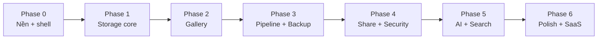

# 04 — DEVELOPMENT ROADMAP

# HuaCloud — Kế hoạch phát triển theo giai đoạn

| | |
|---|---|
| **Sản phẩm** | HuaCloud |
| **Owner** | Hua Hưng |
| **Phiên bản tài liệu** | 1.1 |
| **Ngày cập nhật** | 2026-07-06 |
| **Bộ tài liệu** | [00 Audit](00_CODEBASE_AUDIT.md) · [01 Vision](01_PROJECT_VISION.md) · [02 PRD](02_PRODUCT_REQUIREMENTS.md) · [03 Architecture](03_SYSTEM_ARCHITECTURE.md) · [05 Claude Plans](05_CLAUDE_NEXT_PLANS.md) |

> Roadmap này biến repo hiện tại thành sản phẩm độc lập mang thương hiệu HuaCloud. Tên model, env var, route, Inngest function trong tài liệu này lấy **nguyên văn từ [03 Architecture](03_SYSTEM_ARCHITECTURE.md)** — khi có mâu thuẫn, 03 là nguồn chuẩn.

---

## 1. Nguyên tắc lập kế hoạch

1. **Solo dev làm ngoài giờ (~10–15h/tuần).** Mỗi task trong roadmap được cắt để làm xong trong 1–2 buổi tối. Ước lượng tuần dưới đây tính theo nhịp đó.
2. **Cuối mỗi phase sản phẩm phải chạy được, demo được.** Không phase nào kết thúc ở trạng thái nửa vời — nếu hết thời gian, cắt task sang phase sau chứ không để dở.
3. **Chống scope creep:** mọi ý tưởng mới phát sinh ghi vào mục [BACKLOG](#10-backlog-sau-v10) (hoặc file `BACKLOG.md`), không chen vào phase đang chạy.
4. **Kỷ luật database** (ADR-10 trong 03): mọi thay đổi schema qua `prisma migrate dev`, test trên Neon branch trước; không bao giờ `db push` lên production; SQL tay (pgvector HNSW, tsvector) commit trong `prisma/migrations/`.
5. **UI không phụ thuộc Telegram.** Telegram chỉ nằm sau `StorageDriver` trong `src/server/storage/telegram/`.
6. **Không đưa secret thật vào git.** Mọi cấu hình qua `.env.local`, file mẫu là `.env.example`.

---

## 2. Chiến lược repo & rebranding

**Làm trong root hiện tại** (`D:\Dự Án Cá nhân\HuaCloud`) — scaffold Next.js 15 đè lên, code cũ của Telegraph-Image xóa dần khỏi đường chạy chính (chi tiết kỹ thuật cũ đã chốt lại trong [00 Audit](00_CODEBASE_AUDIT.md), không cần giữ file cũ để tham khảo).

**Fresh history khi publish:** trong lúc dev, giữ git history local để dễ lần lại. Trước khi push lên GitHub lần đầu (Phase 0, bước cuối), tạo lịch sử mới để repo public không còn dấu vết upstream (đúng yêu cầu vision + mục 11 của 03):

```bash
git checkout --orphan huacloud-main
git add -A && git commit -m "feat: HuaCloud v0.1 foundation"
git branch -D main && git branch -m main
git remote set-url origin <repo GitHub mới: huacloud>
git push -u origin main
```

**Checklist rebrand (hoàn tất trong Phase 0, rà lại ở Phase 6):**

- [ ] `package.json`: name `huacloud`, xóa scripts wrangler/mocha cũ, dependencies cũ (`@cloudflare/pages-plugin-sentry`, `@sentry/tracing`)
- [ ] Xóa các file gốc: `index.html`, `index-md.html`, `admin*.html`, `admin-imgtc.css`, `whitelist-on.html`, `block-img.html`, `_nuxt/`, `functions/`, `test/`, `README-zh.md`, `bg.svg`, `music.svg`
- [ ] Xóa 3 tracker của upstream (Sentry DSN hardcode, Hotjar, MS Clarity — xem 00 Audit mục 9)
- [ ] Favicon + logo + brand mark HuaCloud mới (placeholder được, không dùng favicon cũ)
- [ ] Metadata Next.js: title/description/Open Graph/manifest mang HuaCloud
- [ ] README.md mới hoàn toàn (viết lại ở Phase 0, hoàn thiện ở Phase 6)
- [ ] LICENSE: repo private trong lúc dev; chọn license khi public (mục 12 của 03)
- [ ] `.github/workflows/`: xóa CI cũ (ci-test.yml, sync.yml), thay bằng CI mới (lint + typecheck + build)
- [ ] Rà toàn repo lần cuối: `grep -ri "telegraph"` không còn kết quả trong code chính

---

## 3. Tổng quan 7 phase

| Phase | Tuần | Tên | Deliverable chính | Milestone |
|---|---|---|---|---|
| **0** | 1 | Nền tảng + brand + app shell | App HuaCloud chạy được, đăng nhập được, UI shell + mock, CI/CD | — |
| **1** | 2–3 | Storage core | Upload thật → Telegram → xem lại → xóa thật, end-to-end | **M1: tự upload/xem được** |
| **2** | 4–5 | Gallery & tổ chức | Grid/masonry/list/timeline, albums, favorites, trash, multi-select | **M2: thay hẳn image host cũ** |
| **3** | 6 | Image pipeline + Export/Backup | Thumb/preview WebP trên R2, thumbhash, EXIF, backup tự động | — |
| **4** | 7 | Share & security | Share link (password/expiry/QR), API key, rate limit, audit | **M3: mời người khác dùng** |
| **5** | 8–9 | AI & search | Caption/tags/OCR tự động, natural language search, similar | **M4: demo AI search** |
| **6** | 10+ | Polish & SaaS-ready | Analytics, admin, i18n, landing, docs, đường thoát Docker | **M5: v1.0 portfolio-ready** |

**Mapping với 3 plan trong [05 Claude Plans](05_CLAUDE_NEXT_PLANS.md):** Plan 1 = Phase 0 · Plan 2 = Phase 1 + gallery cơ bản của Phase 2 · Plan 3 = phần còn lại Phase 2 → 6 (rút gọn). Plan là đơn vị "một phiên Claude"; phase là đơn vị "sản phẩm dùng được".



---

## 4. Phase 0 — Nền tảng + brand + app shell (tuần 1, ~12h)

**Mục tiêu:** chuyển repo từ Telegraph-Image clone sang nền HuaCloud sạch: Next.js 15 + auth + UI shell, deploy tự động.

### Setup & hạ tầng

- [ ] Scaffold Next.js 15 (App Router, TypeScript strict, Tailwind) trong root; cấu trúc thư mục đúng mục 3 của 03 (`src/app`, `src/features`, `src/components/{ui,layout}`, `src/server/{db,services,storage,ai,media,inngest,security}`, `src/lib`, `src/types`, `prisma/`)
- [ ] Xóa toàn bộ file cũ theo checklist rebrand (mục 2)
- [ ] Cài shadcn/ui + theme dark mặc định (palette trung tính premium, radius ≤ 8px, tránh tím/xanh đậm một màu)
- [ ] `src/lib/env.ts`: Zod-validated env, fail-fast lúc boot; tạo `.env.example` đủ các biến trong bảng 11.2 của 03 (`DATABASE_URL`, `DIRECT_URL`, `BETTER_AUTH_SECRET`, `BETTER_AUTH_URL`, `NEXT_PUBLIC_APP_URL`, `TG_BOT_TOKEN`, `TG_CHAT_ID`, `BLOB_READ_WRITE_TOKEN`, `R2_ACCOUNT_ID`, `R2_ACCESS_KEY_ID`, `R2_SECRET_ACCESS_KEY`, `R2_BUCKET`, `R2_PUBLIC_BASE_URL`, `SIGNING_SECRET`, `INNGEST_EVENT_KEY`, `INNGEST_SIGNING_KEY`, `GEMINI_API_KEY`)
- [ ] Tạo Neon project + branch `dev`; `CREATE EXTENSION vector` trong migration đầu
- [ ] Setup Vercel project + GitHub Actions CI (typecheck + lint + build trên mỗi PR)

### Auth & database khởi đầu

- [ ] Prisma schema **đầy đủ theo mục 4 của 03** ngay migration đầu tiên (ADR-08): `User`, `Session`, `Account`, `Verification`, `Workspace`, `WorkspaceMember`, `StorageChannel`, `Asset`, `StoragePart`, `Album`, `AlbumAsset`, `Share`, `ApiKey`, `Activity`, `UsageEvent` + enums (`WorkspaceRole`, `AssetKind`, `AssetStatus`, `StorageBackend`, `PartVariant`, `ChannelStatus`, `UsageMetric`)
- [ ] SQL tay trong migration: cột `embedding vector(768)` + HNSW index, tsvector generated column + GIN index (mục 4 của 03)
- [ ] Better Auth: email/password (+ Google OAuth nếu kịp); sign-up hook auto tạo `Workspace` + `WorkspaceMember{role: OWNER}`; middleware bảo vệ route group `(app)`
- [ ] `src/server/db/client.ts`: PrismaClient singleton (Neon adapter); seed script tạo user + workspace demo

### UI shell (mock data)

- [ ] App shell: sidebar (Dashboard, Gallery, Albums, Favorites, Shared, Trash, Settings) + topbar (search, upload button, user menu) — responsive
- [ ] Trang `(app)`: dashboard + gallery render mock asset list, có đủ loading/empty/error state
- [ ] Landing page `(marketing)` ngắn gọn, brand HuaCloud, dark, không marketing rỗng
- [ ] Metadata/OG/favicon HuaCloud

### Definition of Done

- [ ] `npm run dev` / `build` / `lint` / `typecheck` đều pass
- [ ] Đăng ký → đăng nhập → vào dashboard hoạt động trên Vercel deploy thật
- [ ] `npx prisma migrate dev` chạy sạch trên Neon branch dev
- [ ] Không còn dấu vết Telegraph-Image trong UI/package/README

**Rủi ro phase:** Better Auth + Prisma adapter lần đầu setup có thể ngốn thời gian → nếu kẹt > 2 buổi, dùng email/password tối thiểu, OAuth để Phase 6. Schema đầy đủ ngay từ đầu là bắt buộc — đừng cắt bảng "chưa dùng" (đó là những bảng đắt nhất để thêm sau).

---

## 5. Phase 1 — Storage core (tuần 2–3, ~25h) → M1

**Mục tiêu:** luồng sống còn của sản phẩm: upload thật → original lên Telegram → xem lại → xóa thật. Đây là phase rủi ro kỹ thuật cao nhất, làm sớm nhất có thể.

### Telegram driver (`src/server/storage/telegram/`)

- [ ] `client.ts`: fetch wrapper Bot API (sendDocument, getFile, deleteMessage) — timeout, typed errors, không retry ở tầng này
- [ ] `driver.ts`: implement interface `StorageDriver` (mục 5.1 của 03): `put()` qua sendDocument (KHÔNG sendPhoto — giữ nguyên bytes), parse `file_id` + lưu `tgMessageId`/`tgChatId`; `delete()` qua deleteMessage
- [ ] `path-cache.ts`: cache `tgFilePath` TTL 50 phút (cột trong `StoragePart`), retry 1 lần khi 404
- [ ] Chặn cứng 20MB/file (Zod client + server); lỗi rõ ràng khi token/chat sai
- [ ] Seed 1 dòng `StorageChannel` từ `TG_BOT_TOKEN`/`TG_CHAT_ID`

### Upload flow (mục 6 của 03)

- [ ] `/api/upload/route.ts`: `handleUpload` của `@vercel/blob/client` — client upload thẳng lên Blob staging (né giới hạn 4.5MB body)
- [ ] Server action tạo `Asset{status: PENDING}` + `StoragePart{variant: ORIGINAL}`; bắn event `asset/uploaded`
- [ ] Inngest function `process-asset` (bản Phase 1): mark PROCESSING → validate magic bytes (`file-type`) → sha256 dedupe → sendDocument Telegram → finalize READY → cleanup Blob; throttle 18/phút theo `tgChatId`, retry 4 lần exponential backoff, `onFailure` → FAILED + Activity (Sharp/R2 bổ sung ở Phase 3)
- [ ] UI upload: dropzone drag-drop + chọn file, multi-file, progress từng file, hiển thị trạng thái PENDING/PROCESSING/READY/FAILED (poll React Query)

### Serve

- [ ] Route `/f/[assetId]`: auth session → resolve `StoragePart` ORIGINAL → tgFilePath (cache) → stream từ Telegram, `Cache-Control` immutable
- [ ] Gallery cơ bản đọc DB thật (grid đơn giản, ảnh tạm dùng `/f/` proxy — thumbnail đến ở Phase 3)
- [ ] Delete: soft delete (`deletedAt`) từ UI; Inngest `delete-asset` (deleteMessage + xóa row) cho hard delete

### Definition of Done

- [ ] Upload 1 ảnh từ UI → thấy trong gallery → refresh vẫn còn → tải bản gốc đúng checksum → xóa mất hẳn (cả trên Telegram, kiểm tra bằng channel)
- [ ] Upload file 25MB bị từ chối với thông báo rõ ràng ngay ở client
- [ ] Rút mạng giữa chừng → asset hiển thị FAILED, không kẹt PENDING mãi
- [ ] Upload 20 ảnh liên tiếp → tất cả READY (queue throttle hoạt động, không dính 429)

**Rủi ro phase:** rate limit Telegram (~20 msg/phút/chat) làm batch lớn chậm → UX phải nói rõ "đã nhận, đang xử lý". Inngest local dev cần `npx inngest-cli dev` — làm quen sớm ngay task đầu.

---

## 6. Phase 2 — Gallery & tổ chức (tuần 4–5, ~25h) → M2

**Mục tiêu:** HuaCloud thay hẳn image host cũ trong công việc hằng ngày của Hưng.

### Gallery

- [ ] Grid/masonry/list/timeline view (virtualized — `react-virtuoso` hoặc tương đương), infinite scroll
- [ ] Lightbox: điều hướng phím (`←`/`→`/`Esc`/`F`/`Del`), panel info (fileName, size, mime, EXIF, thời gian), copy link/direct URL, tải bản gốc (chi tiết GA-04 trong 02)
- [ ] Multi-select (click + shift, kéo chuột) + batch ops: xóa, favorite, thêm vào album
- [ ] Upload nâng cao: paste Ctrl+V, kéo-thả cả thư mục, retry file lỗi

### Tổ chức

- [ ] Albums: CRUD, thêm/bớt asset, ảnh bìa, trang `/albums/[albumId]`
- [ ] Favorites (toggle + trang riêng), rename asset
- [ ] Trash: soft delete 30 ngày, restore, xóa vĩnh viễn; Inngest cron `purge-trash` (3h sáng hằng ngày)
- [ ] Search filename: `ILIKE`/`pg_trgm` + unaccent (gõ không dấu vẫn khớp), debounce 300ms (SE-01 trong 02)

### Definition of Done

- [ ] Gallery 1.000+ ảnh cuộn mượt (virtualized, không đơ)
- [ ] Toàn bộ thao tác hằng ngày (upload → tìm → xem → chia album → xóa) < 3 click
- [ ] Xóa nhầm → khôi phục được từ Trash; sau 30 ngày tự purge thật
- [ ] Hưng ngừng dùng image host cũ, dùng HuaCloud hằng ngày

**Rủi ro phase:** gallery lúc này vẫn serve original qua proxy (chưa có thumbnail) → chậm với ảnh to; chấp nhận trong 2 tuần, Phase 3 giải quyết. Nếu quá khó chịu, kéo task thumbnail của Phase 3 lên sớm.

---

## 7. Phase 3 — Image pipeline + Export/Backup (tuần 6, ~12h)

**Mục tiêu:** gallery nhanh thật sự; dữ liệu có đường lui trước khi mời người khác dùng.

### Image pipeline (bổ sung vào `process-asset`)

- [ ] `src/server/media/process.ts`: Sharp — thumb 320px WebP + preview 1024px WebP, autorotate theo EXIF
- [ ] Upload derivatives lên R2 (`r2.driver.ts`, bucket `huacloud-derived`, public qua `R2_PUBLIC_BASE_URL` = `cdn.<domain>`)
- [ ] thumbhash (~28 bytes, cột `Asset.thumbhash`) → blur placeholder render tức thì; `exif.ts` extract `takenAt`/camera; dominant colors
- [ ] Backfill job cho asset đã upload trước Phase 3 (IM-02 trong 02)
- [ ] Gallery/lightbox chuyển sang thumb/preview từ CDN — original chỉ khi bấm "Tải bản gốc"

### Export/Backup (ST-03 trong 02, ADR-09 trong 03 — làm sớm, không để cuối)

- [ ] Inngest `backup-export`: cron tuần (CN 4h) + nút bấm tay — export metadata JSON + zip originals theo batch → R2 `hc-backup/`
- [ ] Bật Neon PITR; document quy trình restore trong README
- [ ] Trang Settings hiển thị lần backup gần nhất

### Definition of Done

- [ ] Grid load từ CDN, thumb < 30KB, blur placeholder không giật layout
- [ ] Upload mới tự có đủ thumb/preview/thumbhash/EXIF; asset cũ được backfill hết
- [ ] Chạy backup tay thành công; kiểm tra file zip trong R2 mở được

---

## 8. Phase 4 — Share & security (tuần 7, ~12h) → M3

**Mục tiêu:** chia sẻ ra ngoài an toàn; đủ cứng để mời người khác dùng.

- [ ] Share model đầy đủ: public/private link `/s/[token]`, password (hash), `expiresAt`, `maxDownloads`, revoke, QR code
- [ ] Signed URL HMAC-SHA256 (`?sig=&exp=`, `src/server/security/signed-url.ts`) cho file trong share công khai → Cloudflare CDN cache được không hit auth
- [ ] Inngest cron `expire-shares` (hằng giờ)
- [ ] API key: format `hc_live_<nanoid>`, lưu SHA-256 hash, scopes (`asset:read/write`, `share:write`); REST `/api/v1/` upload/list/get/delete (kèm endpoint tương thích format cũ `[{src}]` — mục 6 của 02)
- [ ] Rate limit 2 tầng (Cloudflare rule + app-level trên Postgres — mục 10.5 của 03)
- [ ] Audit: ghi `Activity` cho mọi action nhóm Auth/Asset/Album/Share/API (bảng 10.8 của 03); trang xem audit log đơn giản
- [ ] CSP headers + rà mutation: không mutation nào qua GET

### Definition of Done

- [ ] Share link có password + hết hạn hoạt động đúng; revoke có hiệu lực (chấp nhận trễ TTL signed URL ~1h)
- [ ] Upload qua API key bằng `curl` thành công; key bị revoke thì 401
- [ ] Trang share công khai không lộ bất kỳ thông tin Telegram/nội bộ nào

---

## 9. Phase 5 — AI & search (tuần 8–9, ~20h) → M4

**Mục tiêu:** điểm khác biệt của HuaCloud — tìm "ảnh áo xanh", "hóa đơn tháng 6" bằng tiếng Việt.

- [ ] `src/server/ai/enrich.ts`: Vercel AI SDK `generateObject` + `AiEnrichmentSchema` (Zod) — 1 call Gemini 2.5 Flash trên preview 1024px trả caption tiếng Việt + tags + ocrText + objects + colors (mục 8.1 của 03)
- [ ] Inngest `enrich-asset` (trigger sau READY, throttle 10/phút theo RPM free tier); AI lỗi/hết quota KHÔNG ảnh hưởng upload
- [ ] Embedding `gemini-embedding-001` 768d trên chuỗi caption+tags+ocrText+fileName → cột `embedding` pgvector
- [ ] Hybrid search: tsvector FTS + vector cosine, merge Reciprocal Rank Fusion (SQL mục 8.3 của 03); filter màu/loại/ngày/album
- [ ] "Tìm ảnh tương tự" từ lightbox (query bằng embedding của chính asset)
- [ ] Smart albums (điều kiện tự động theo tag/loại/ngày)
- [ ] UI: AI metadata trong lightbox panel; search bar hiểu ngôn ngữ tự nhiên; nút re-enrich; settings bật/tắt AI
- [ ] Không có `GEMINI_API_KEY` → toàn bộ tính năng AI tự ẩn, app vẫn là DAM đầy đủ

### Definition of Done

- [ ] "tìm ảnh áo xanh" / "hóa đơn tháng 6" trả kết quả hợp lý trên thư viện thật của Hưng
- [ ] Enrich 100 ảnh không vượt quota free tier (kiểm tra `UsageEvent`)
- [ ] Tắt API key → không lỗi, không màn hình trắng, UI AI biến mất

**Rủi ro phase:** chất lượng NL search tiếng Việt phụ thuộc caption Gemini — test sớm với 20–30 ảnh thật ngay tuần đầu Phase 5 trước khi commit UX search; nếu yếu, tăng chi tiết prompt caption trước khi nghĩ đến CLIP.

---

## 10. Phase 6 — Polish & SaaS-ready (tuần 10+, ~15h) → M5

- [ ] Analytics: tổng asset/dung lượng, upload theo ngày, top share/download (từ `UsageEvent` + `Activity`)
- [ ] Admin panel `(admin)`: users, `StorageChannel` health, queue status
- [ ] Inngest cron `reconcile-assets` (asset kẹt >30 phút, verify sample part Telegram, channel DEGRADED)
- [ ] Settings hoàn thiện: profile, theme, workspace, API keys, backup, diagnostics (DB/storage/AI status)
- [ ] i18n vi/en (chuỗi đã dùng key từ Phase 0)
- [ ] Landing page hoàn thiện + SEO + OG image
- [ ] Docs: README đầy đủ (setup Telegram bot, Neon, R2, Inngest, deploy Vercel), CONTRIBUTING, kiến trúc tóm tắt
- [ ] Đường thoát self-host: `docker-compose.yml` (Next standalone + Postgres + Inngest self-host) + hướng dẫn — outline, hoàn thiện khi có nhu cầu thật
- [ ] Rà rebrand lần cuối (`grep -ri telegraph`), quét secret, Lighthouse ≥ 90 landing/dashboard

### Definition of Done

- [ ] Người lạ clone repo → theo README dựng được bản chạy trong < 30 phút
- [ ] v1.0 tag; portfolio-ready: landing + demo + docs sạch

---

## 11. Kế hoạch 7 ngày đầu (kick-start)

1. **Ngày 1–2:** Phase 0 setup + rebrand + scaffold; cuối ngày 2 `npm run build` pass, deploy Vercel trống.
2. **Ngày 3:** Prisma schema đầy đủ + migration đầu + Better Auth; đăng nhập được.
3. **Ngày 4:** UI shell + gallery mock; dashboard click được các khu vực chính.
4. **Ngày 5–6:** Telegram driver + upload flow tối thiểu (Phase 1 bắt đầu); upload 1 ảnh thật thành công.
5. **Ngày 7:** serve `/f/` + gallery đọc DB thật; nghỉ và review lại tuần.

> AI (Phase 5) chỉ bắt đầu khi upload/gallery đã dùng thật ổn — làm AI quá sớm thì sản phẩm đẹp trên giấy nhưng không dùng được.

---

## 12. Bảng rủi ro tổng

| # | Rủi ro | Xác suất | Tác động | Giảm thiểu | Phase |
|---|---|---|---|---|---|
| 1 | Telegram không SLA: bot ban / channel mất → mất original | Thấp | Nghiêm trọng | `StorageBackend` enum sẵn đường swap R2; backup-export định kỳ | 1, 3 |
| 2 | Mất Postgres = mapping `file_id` thành rác vĩnh viễn | Thấp | Nghiêm trọng | Neon PITR + backup-export tuần + document restore | 0, 3 |
| 3 | Scope creep (solo dev, 12 khu vực UI + AI) | **Cao** | Cao | Kỷ luật phase + BACKLOG.md; cắt task sang sau, không kéo dài phase | Tất cả |
| 4 | Rate limit Telegram làm batch upload chậm | Cao | Trung bình | Throttle Inngest theo `tgChatId` + UX "đã nhận, đang xử lý"; multi-channel khi cần | 1 |
| 5 | Hưng chưa quen Prisma/Postgres → schema drift | Trung bình | Cao | ADR-10: migrate dev + Neon branch, không db push prod | 0+ |
| 6 | NL search tiếng Việt chất lượng thấp | Trung bình | Trung bình | Test sớm 20–30 ảnh thật đầu Phase 5; tinh chỉnh prompt caption | 5 |
| 7 | Gemini đổi quota/pricing free tier | Trung bình | Thấp | Vercel AI SDK — swap provider 1 dòng config (ADR trong 03) | 5 |
| 8 | Vercel Hobby cấm thương mại / function timeout khi stream file lớn | Trung bình | Trung bình | Lên Pro khi mở người ngoài; serve derivative từ CDN, original ≤ 20MB | 4+ |
| 9 | Better Auth setup phức tạp hơn dự kiến | Trung bình | Thấp | Email/password trước, OAuth sau; organization plugin bật config nhưng không lộ UI | 0 |
| 10 | Burnout / mất nhịp làm ngoài giờ | Trung bình | Cao | Milestone nhỏ dùng được thật (M1 tuần 3, M2 tuần 5) để giữ động lực | Tất cả |

---

## 13. Quy trình làm việc hằng tuần

- **Branch:** `feat/<phase>-<task>` → PR vào `main` (tự review bằng checklist), squash merge; conventional commits (`feat:`, `fix:`, `chore:`, `docs:`)
- **Checklist trước merge:** `npm run typecheck` + `lint` + `build` pass; nếu đổi schema: `prisma migrate dev` chạy sạch trên Neon branch dev
- **Deploy:** merge `main` → Vercel auto deploy; preview deployment cho PR
- **Cuối tuần:** 15 phút review — phase đang ở đâu, task nào cắt sang sau, cập nhật checkbox trong file này

---

## 14. BACKLOG sau v1.0

- Chunking file > 20MB (`StoragePart.partIndex` đã sẵn) + local Bot API server (VPS)
- CLIP cross-modal embedding (search ảnh không phụ thuộc caption)
- Multi-workspace UI + mời thành viên + Stripe billing (schema đã sẵn: `Workspace`, `WorkspaceMember`, `UsageEvent`)
- Video transcode + poster frame; editor ảnh (crop/rotate/watermark UI nâng cao)
- PWA nâng cao / mobile app; webhook cho API; import từ Google Photos/Drive
- Public API mở rộng + docs OpenAPI

---

## Tài liệu liên quan

| File | Nội dung |
|---|---|
| [00_CODEBASE_AUDIT.md](00_CODEBASE_AUDIT.md) | Khảo sát chi tiết repo gốc — cái gì tham khảo được, cái gì bỏ |
| [01_PROJECT_VISION.md](01_PROJECT_VISION.md) | Tầm nhìn, mục tiêu, yêu cầu thương hiệu HuaCloud |
| [02_PRODUCT_REQUIREMENTS.md](02_PRODUCT_REQUIREMENTS.md) | Chi tiết từng tính năng, user story, acceptance criteria |
| [03_SYSTEM_ARCHITECTURE.md](03_SYSTEM_ARCHITECTURE.md) | Kiến trúc hệ thống, schema, luồng dữ liệu — **nguồn chuẩn khi mâu thuẫn** |
| [05_CLAUDE_NEXT_PLANS.md](05_CLAUDE_NEXT_PLANS.md) | 3 prompt thực thi cho các phiên Claude Code tiếp theo |
